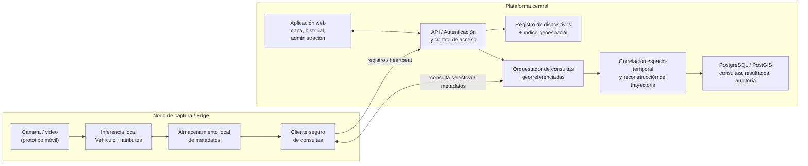

# Primer informe del proyecto — VIGÍA

**Plataforma distribuida de vigilancia comunitaria basada en visión por computador y edge computing**

| Información | Detalle |
|---|---|
| **Institución** | Universidad del Norte |
| **Programa** | Ingeniería de Sistemas |
| **Docente proponente** | Augusto Salazar |
| **Co-asesora** | Diana Roca |
| **Área** | Ingeniería de Software / Arquitectura de Software / Desarrollo Web y Móvil |
| **Periodo académico** | 2026-30 |
| **Lugar y fecha** | Barranquilla, Colombia — Agosto de 2026 |

---

## Resumen / Abstract

### Resumen

La información generada por cámaras privadas y dispositivos de vigilancia orientados hacia zonas de circulación vehicular suele permanecer aislada en cada punto de captura. Cuando se requiere establecer por dónde pudo desplazarse un vehículo de interés, esta fragmentación obliga a localizar fuentes, revisar video y correlacionar manualmente horarios y ubicaciones, un proceso que no escala con el número de cámaras y que además incrementa la exposición de imágenes que pueden contener datos personales. VIGÍA propone abordar este déficit mediante una plataforma de vigilancia comunitaria basada en crowdsourcing, en la que dispositivos voluntariamente registrados realizan procesamiento local del video para detectar vehículos y extraer metadatos relevantes. La plataforma central consulta de forma selectiva los nodos cercanos a un área geográfica, consolida las detecciones compatibles y estima una trayectoria a partir de relaciones espaciales y temporales, evitando la transmisión continua de video. El proyecto tendrá alcance de prototipo funcional durante el periodo académico 2026-30 e incluirá un nodo de captura simulado mediante dispositivo móvil, servicios backend, una aplicación web de administración y visualización cartográfica, mecanismos básicos de seguridad y una estrategia de validación técnica. El desarrollo seguirá un enfoque de prototipado iterativo, con ciclos de diseño, implementación, prueba y ajuste orientados a reducir tempranamente los riesgos de precisión, interoperabilidad, rendimiento y privacidad.

**Palabras clave:** edge computing, visión por computador, vigilancia comunitaria, sistemas distribuidos, reconocimiento vehicular, geolocalización.

### Abstract

Video and vehicle information produced by privately owned cameras and surveillance devices is commonly isolated at each capture point. When operators need to estimate where a vehicle of interest may have traveled, this fragmentation leads to manual video review and manual correlation of timestamps and locations, a process that scales poorly and increases the exposure of imagery that may contain personal data. VIGÍA addresses this deficit through a crowdsourced community-surveillance platform in which voluntarily registered devices perform local video processing to detect vehicles and extract relevant metadata. The central platform selectively queries devices near a geographic area, consolidates compatible detections, and estimates a trajectory from spatial and temporal relationships without continuously streaming video to a central server. The project is scoped as a functional prototype for the 2026-30 academic term and includes a mobile-device capture-node prototype, backend services, a web-based administration and mapping interface, baseline security mechanisms, and a technical validation strategy. Development will follow an iterative prototyping approach with successive design, build, test, and refinement cycles focused on reducing accuracy, interoperability, performance, and privacy risks early in the project.

**Keywords:** edge computing, computer vision, community surveillance, distributed systems, vehicle recognition, geolocation.

## 1. Introducción

La seguridad urbana y la gestión inteligente de entornos residenciales se apoyan cada vez más en redes de cámaras, sistemas de información geográfica, inteligencia artificial y dispositivos conectados. Dentro de este contexto, la visión por computador permite transformar secuencias de video en eventos y atributos estructurados, mientras que el edge computing desplaza parte del procesamiento hacia el punto donde se generan los datos. Esta combinación resulta especialmente relevante para aplicaciones de ciudades inteligentes porque disminuye la necesidad de transportar video completo hacia servidores centrales y permite reaccionar con menor latencia. La investigación reciente en seguimiento vehicular multicámara confirma que correlacionar detecciones distribuidas es un problema activo y técnicamente complejo, debido a variaciones de perspectiva, iluminación, oclusiones y similitud entre vehículos [1]-[3].

A pesar de estos avances, en escenarios comunitarios la información disponible se encuentra fragmentada. Una vivienda, conjunto residencial, comercio o pequeña organización puede disponer de cámaras orientadas hacia su entorno inmediato, pero cada instalación funciona como una isla de información. Cuando surge la necesidad de ubicar un vehículo o estimar su recorrido, la respuesta suele depender de revisar grabaciones de forma manual, solicitar acceso a varias fuentes y comparar horas y descripciones. Además de ser lento, este enfoque tiende a centralizar o compartir más video del estrictamente necesario. En Colombia, la captación, transmisión, almacenamiento y reproducción de imágenes mediante videovigilancia constituye tratamiento de datos personales y debe observar principios de finalidad, seguridad, necesidad y confidencialidad [4], [5].

La necesidad técnica identificada consiste, por tanto, en correlacionar observaciones vehiculares provenientes de múltiples puntos de captura sin convertir la solución en un repositorio central permanente de video. Esto abre una oportunidad de diseño alrededor de una arquitectura distribuida: cada nodo puede ejecutar inferencia local, conservar temporalmente metadatos de las detecciones y responder únicamente cuando una consulta geográfica sea pertinente. La plataforma central puede concentrarse en autenticar participantes, seleccionar nodos cercanos, combinar evidencias y reconstruir una trayectoria probable. En términos de ingeniería, el reto integra visión por computador, sistemas distribuidos, seguridad, comunicación asíncrona, consultas geoespaciales y diseño orientado a privacidad.

VIGÍA es la solución propuesta para explorar esta oportunidad. El sistema se plantea como una plataforma de vigilancia comunitaria basada en crowdsourcing voluntario, compuesta por nodos de captura y una plataforma central. Los nodos detectarán automóviles y motocicletas, extraerán atributos como tipo de vehículo, color, dirección, fecha y hora, ubicación y, cuando la calidad de la imagen lo permita, información de placa y otros atributos visuales útiles para la correlación. La plataforma administrará usuarios y dispositivos, emitirá consultas a nodos geográficamente relevantes, consolidará resultados y presentará sobre un mapa una ruta estimada. El proyecto no pretende reemplazar sistemas oficiales de seguridad ni producir evidencia concluyente, sino demostrar técnicamente un enfoque escalable y minimizador de datos para búsqueda vehicular distribuida.

## 2. Planteamiento del problema

En redes de videovigilancia conformadas por cámaras independientes y administradas por distintos propietarios, las observaciones sobre el tránsito de vehículos permanecen distribuidas, heterogéneas y difícilmente correlacionables. Este estado genera una baja capacidad para reconstruir de manera oportuna el recorrido aproximado de un vehículo de interés a partir de múltiples puntos de observación. La problemática afecta a comunidades residenciales, operadores de seguridad y administradores de entornos privados que podrían colaborar legítimamente en escenarios de monitoreo, pero que hoy dependen de procesos manuales o de soluciones cerradas que exigen centralizar infraestructura, video o licenciamiento especializado.

### 2.1 Descripción del problema

El problema central es la fragmentación de la información vehicular capturada por dispositivos de vigilancia independientes, lo cual dificulta identificar detecciones relacionadas y reconstruir una secuencia espacio-temporal útil sin revisar o transferir grandes volúmenes de video. No se trata únicamente de la inexistencia de una aplicación, sino de una condición operativa deficiente: cada cámara observa un tramo limitado, registra datos bajo condiciones distintas y normalmente carece de mecanismos para intercambiar información semántica con otros puntos de captura.

Entre las causas principales se encuentran la ausencia de un formato común de metadatos, la heterogeneidad del hardware, la dependencia de revisión humana, la falta de índices geoespaciales para seleccionar fuentes relevantes y la dificultad de reconocer un mismo vehículo cuando cambia el ángulo de captura. La literatura de seguimiento multicámara muestra que la asociación entre cámaras requiere combinar atributos visuales con restricciones de tiempo, topología y localización para reducir candidatos incorrectos [1]-[3]. A esto se suma que transmitir video continuamente a una plataforma central incrementa el consumo de ancho de banda y la superficie de exposición de información sensible; trabajos de vigilancia distribuida han demostrado que mover parte del análisis al borde puede reducir sustancialmente el tráfico de red [6].

La población objetivo está compuesta por operadores de monitoreo y comunidades que disponen de puntos de captura autorizados y desean colaborar de manera controlada. Para ellos, las consecuencias del problema incluyen mayores tiempos de búsqueda, dificultad para responder cuando existen muchos dispositivos, baja trazabilidad sobre quién consultó información y riesgo de compartir imágenes que no son necesarias para el propósito de la consulta. Desde la perspectiva técnica, también se presentan problemas de escalabilidad: una estrategia que pregunte a todos los nodos o concentre todos los flujos de video eleva rápidamente el costo de cómputo, almacenamiento y comunicaciones.

| **Causa o condición**            | **Manifestación**                                                   | **Consecuencia**                                                    |
|----------------------------------|---------------------------------------------------------------------|---------------------------------------------------------------------|
| Fuentes de video aisladas        | Cada dispositivo conserva información sin interoperabilidad.        | La correlación entre lugares depende de procesos manuales.          |
| Heterogeneidad de captura        | Ángulos, iluminación, resolución y hardware diferentes.             | Disminuye la confiabilidad de la identificación del mismo vehículo. |
| Centralización de video          | La búsqueda exige mover o revisar grabaciones completas.            | Aumentan ancho de banda, almacenamiento y exposición de datos.      |
| Ausencia de selección geográfica | Se consultan demasiadas fuentes o no se sabe cuáles son relevantes. | Mayor latencia y menor escalabilidad.                               |
| Asociación multicámara compleja  | Vehículos similares y oclusiones generan falsos emparejamientos.    | La ruta estimada puede ser incompleta o incorrecta.                 |

*Tabla 1. Síntesis de causas y consecuencias de la problemática.*

### 2.2 Justificación

La atención del problema es pertinente porque existe una tensión concreta entre disponibilidad de cámaras y capacidad real de aprovechar sus observaciones de forma coordinada. Una solución que convierta video en metadatos locales y permita consultas selectivas puede reducir el esfuerzo de revisión y, al mismo tiempo, limitar la cantidad de información transferida. El enfoque es coherente con arquitecturas modernas de analítica de video en el borde: productos comerciales como AXIS License Plate Verifier ejecutan reconocimiento directamente en la cámara [7], y plataformas como Verkada también emplean procesamiento en el borde para analítica de matrículas [8].

Desde el punto de vista académico, VIGÍA integra áreas centrales de la Ingeniería de Sistemas: arquitectura de software, sistemas distribuidos, desarrollo web y móvil, bases de datos geoespaciales, ciberseguridad, inteligencia artificial y validación de calidad. La dificultad no está en construir una pantalla de búsqueda aislada, sino en diseñar contratos entre componentes, manejar nodos potencialmente intermitentes, filtrar consultas por ubicación, normalizar resultados de visión por computador y tomar decisiones de correlación bajo incertidumbre. Esto convierte el proyecto en una experiencia de diseño de solución tecnológica con restricciones realistas de tiempo, recursos, seguridad y operación.

La pertinencia social y práctica se relaciona con la posibilidad de aprovechar infraestructura de captura ya existente sin asumir que toda la información debe centralizarse. Sin embargo, la utilidad del sistema depende de mantener límites claros. La Superintendencia de Industria y Comercio ha señalado que la videovigilancia implica tratamiento de datos personales y exige especial diligencia por su carácter intrusivo [4]. En consecuencia, el proyecto adoptará como criterio de diseño la minimización de datos: procesamiento local, transmisión bajo demanda, control de acceso, auditoría de consultas y uso exclusivo de escenarios de prueba autorizados durante la etapa académica.

### 2.3 Restricciones y supuestos iniciales

- El proyecto se desarrollará durante el periodo académico 2026-30, por lo que el resultado esperado es un prototipo funcional y no una plataforma productiva de alcance ciudad.

- El equipo se organizará alrededor de componentes backend, web y nodo de captura/móvil, con recursos de cómputo y tiempo propios de un proyecto académico.

- El nodo de captura final está pensado para hardware IoT de bajo consumo; durante el proyecto se permite simularlo mediante dispositivos móviles o equipos de desarrollo, siempre que las interfaces queden desacopladas del hardware.

- Las pruebas con video se realizarán en datasets públicos o escenarios controlados y autorizados. No se plantea recolectar de manera indiscriminada información de ciudadanos para entrenar o validar el prototipo.

- La precisión de los modelos dependerá de iluminación, oclusiones, velocidad, perspectiva y resolución. La placa, marca o modelo del vehículo solo podrán emplearse cuando la confianza de la detección sea suficiente.

- La reconstrucción de trayectoria será probabilística o aproximada; su resultado no se considerará prueba legal ni identificación infalible de un vehículo.

- La comunicación distribuida presupone conectividad IP. El diseño deberá tolerar nodos temporalmente desconectados, pero no garantizará operación en ausencia prolongada de red.

- Se priorizarán herramientas open-source y servicios gratuitos o de bajo costo. Soluciones propietarias se usarán como referencia del estado del arte, no como dependencia obligatoria.

- El prototipo no incluirá reconocimiento facial, identificación de personas, integración con bases policiales, listas oficiales de vehículos ni automatización de decisiones sancionatorias.

- El tratamiento de datos deberá considerar la Ley 1581 de 2012, los lineamientos aplicables de la SIC y principios de seguridad, finalidad, acceso restringido y retención limitada [4], [5].

## 3. Alcance del proyecto

El proyecto comprende el diseño, implementación e integración de un prototipo funcional de VIGÍA. Se cubrirá el flujo completo desde la captura y análisis local de video hasta la consulta distribuida y la visualización de una trayectoria estimada. La arquitectura se diseñará de forma modular para que el nodo móvil utilizado durante la validación pueda ser sustituido posteriormente por un dispositivo IoT sin modificar de manera sustancial los servicios centrales.

### Incluye

- Registro, autenticación y administración básica de usuarios y dispositivos de captura.

- Nodo de captura prototipo capaz de adquirir video y ejecutar o invocar inferencia local para detectar automóviles y motocicletas.

- Extracción de metadatos por detección: tipo de vehículo, color, dirección aproximada de desplazamiento, fecha y hora, ubicación del dispositivo y atributos adicionales de identificación cuando sean técnicamente confiables.

- Almacenamiento local temporal de metadatos y mecanismo para responder consultas sin transmitir video de forma permanente.

- Índice geoespacial de dispositivos y selección de nodos cercanos a un punto o zona de interés.

- Orquestación de consultas distribuidas y consolidación de respuestas provenientes de múltiples nodos.

- Algoritmo de correlación espacio-temporal para producir una secuencia de detecciones compatibles y una trayectoria aproximada.

- Aplicación web para administración, creación de consultas, visualización cartográfica de detecciones y rutas, e historial de búsquedas.

- API backend, persistencia de usuarios, dispositivos, consultas, resultados y eventos de auditoría.

- Mecanismos básicos de autenticación, autorización por roles, cifrado en tránsito y validación de mensajes.

- Pruebas funcionales, de precisión, latencia, concurrencia e integración en escenarios controlados.

- Documentación de arquitectura, interfaces, decisiones técnicas, resultados de validación y limitaciones.

### No incluye

- Despliegue masivo o operación 24/7 a escala de ciudad.

- Instalación definitiva sobre cámaras inteligentes, Raspberry Pi o NVIDIA Jetson como requisito de entrega; estos equipos se consideran una ruta de evolución.

- Transmisión o almacenamiento central continuo de todos los flujos de video.

- Integración con sistemas de Policía, tránsito, RUNT, bases gubernamentales, listas de vigilancia o fuentes privadas externas.

- Reconocimiento facial, biometría de personas o seguimiento de peatones.

- Garantías de identificación inequívoca del vehículo o uso del resultado como evidencia judicial.

- Aplicación móvil de usuario final para ciudadanos distinta del nodo de captura prototipo.

- Alta disponibilidad, recuperación ante desastres, soporte operativo post-proyecto o acuerdos de nivel de servicio productivos.

- Entrenamiento de un modelo fundacional desde cero; se priorizará transferencia de aprendizaje, modelos preentrenados y ajuste con datasets apropiados.

## 4. Objetivos

### 4.1 Objetivo general

> **Diseñar, implementar y validar durante el periodo académico 2026-30 un prototipo funcional de VIGÍA, una plataforma distribuida de vigilancia comunitaria que procese video en el borde, extraiga metadatos de vehículos y correlacione detecciones provenientes de múltiples dispositivos georreferenciados, con el propósito de reconstruir y visualizar trayectorias aproximadas mediante consultas selectivas, sin transmitir video de forma permanente a un servidor central.**

| **Criterio SMART** | **Evidencia en el objetivo**                                                                                                                       |
|--------------------|----------------------------------------------------------------------------------------------------------------------------------------------------|
| S - Específico     | Define una plataforma distribuida, procesamiento en el borde, metadatos vehiculares, consultas georreferenciadas y reconstrucción de trayectorias. |
| M - Medible        | Puede verificarse mediante entregables funcionales y métricas de detección, latencia, concurrencia y reconstrucción.                               |
| A - Alcanzable     | Se limita a un prototipo académico, con nodo de captura simulado y escenarios de prueba controlados.                                               |
| R - Relevante      | Ataca directamente la fragmentación de observaciones vehiculares y la necesidad de minimizar transmisión de video.                                 |
| T - Temporal       | Su implementación y validación se acotan al periodo 2026-30.                                                                                       |

*Tabla 2. Análisis SMART del objetivo general.*

### 4.2 Objetivos específicos

1.  Analizar y documentar los requerimientos funcionales, no funcionales, de seguridad y privacidad del prototipo, definiendo criterios de aceptación y métricas de validación antes de finalizar la primera iteración del proyecto.

2.  Diseñar una arquitectura distribuida y desacoplada del hardware que especifique los componentes del nodo de captura, la plataforma central, los contratos de comunicación, el modelo de datos y los mecanismos de selección geoespacial de dispositivos.

3.  Implementar un prototipo de procesamiento local capaz de detectar automóviles y motocicletas y generar metadatos normalizados de cada evento, evaluando su precisión y desempeño bajo diferentes condiciones de captura.

4.  Implementar los servicios backend para registrar dispositivos, autenticar usuarios, almacenar información operativa y emitir consultas únicamente a nodos ubicados dentro de una zona geográfica definida.

5.  Desarrollar un mecanismo de correlación que combine atributos visuales, ubicación y tiempo para asociar detecciones compatibles y construir una trayectoria aproximada entre múltiples dispositivos.

6.  Desarrollar una aplicación web que permita administrar el sistema, formular búsquedas, visualizar detecciones y rutas estimadas sobre un mapa y consultar el historial de operaciones.

7.  Integrar mecanismos de autenticación, autorización, cifrado en tránsito, auditoría y minimización de datos que reduzcan accesos no autorizados y eviten la transmisión permanente de video.

8.  Validar el prototipo mediante escenarios controlados que midan precisión de detección, porcentaje de asociación correcta, latencia de consulta, comportamiento con múltiples nodos concurrentes y cumplimiento de requerimientos funcionales.

## 5. Solución propuesta

VIGÍA se propone como una arquitectura distribuida compuesta por dos grandes dominios: los nodos de captura ubicados cerca de la fuente de video y una plataforma central encargada de coordinación, seguridad, persistencia y visualización. El principio de diseño es que el video se procese lo más cerca posible de su origen y que la plataforma central reciba metadatos únicamente cuando sean necesarios para una consulta. Este enfoque se inspira en experiencias de analítica de video en el borde que buscan disminuir ancho de banda y centralización [6], [7], [12].

*Figura 1. Arquitectura conceptual de VIGÍA y flujo selectivo de metadatos.*

### Nodo de captura

Cada nodo representa un punto de observación voluntariamente registrado. Durante el proyecto podrá implementarse como una aplicación móvil o servicio ejecutado en un equipo de desarrollo. Su responsabilidad es capturar o recibir video, ejecutar inferencia sobre cuadros seleccionados, convertir cada detección en un registro estructurado y conservarlo localmente durante un periodo limitado. El nodo no debe transmitir continuamente el video a la plataforma. Cuando reciba una consulta válida, filtrará su historial local y responderá únicamente con los eventos que cumplan los criterios y la ventana temporal solicitada.

El pipeline inicial de visión por computador se construirá sobre modelos preentrenados y técnicas de transferencia de aprendizaje. Se evaluarán detectores de objetos de una etapa y mecanismos auxiliares para color, dirección y lectura de placa cuando exista suficiente resolución. La salida no será una decisión binaria sobre identidad, sino un conjunto de atributos con niveles de confianza que puedan ponderarse posteriormente en la correlación multicámara.

### Plataforma central

La plataforma central mantendrá el registro de usuarios y dispositivos, sus coordenadas aproximadas, estado de conectividad y capacidades. Una consulta indicará atributos del vehículo, zona geográfica y ventana temporal. El orquestador buscará en un índice geoespacial los nodos pertinentes, enviará la solicitud de forma controlada y consolidará las respuestas. El servicio de correlación ordenará los eventos por tiempo y ubicación, descartará combinaciones físicamente improbables y calculará una trayectoria candidata con un nivel de confianza. La interfaz web mostrará los eventos y segmentos de ruta sobre un mapa, junto con la evidencia de atributos que sustentó la asociación.

### Arquitectura y tecnologías iniciales

La selección tecnológica definitiva se validará mediante pruebas tempranas. Como línea base se propone una arquitectura modular con API backend en TypeScript/NestJS, aplicación web en Next.js/React, almacenamiento relacional PostgreSQL con extensión PostGIS para consultas geográficas, y un componente de visión por computador en Python para entrenamiento y experimentación. La comunicación entre nodos y plataforma podrá usar HTTPS/WebSocket para el prototipo y dejar una abstracción compatible con MQTT para escenarios IoT. Los modelos podrán exportarse a formatos portables como ONNX o TensorFlow Lite según el dispositivo de destino. Docker se utilizará para reproducibilidad de los servicios centrales.

| **Componente**        | **Tecnología candidata**                                      | **Motivo**                                                                      |
|-----------------------|---------------------------------------------------------------|---------------------------------------------------------------------------------|
| Visión por computador | Python, OpenCV, detector preentrenado, OCR/ALPR según pruebas | Rapidez de experimentación y ecosistema de IA.                                  |
| Nodo de captura       | Aplicación móvil o servicio edge con inferencia local         | Simular hardware IoT y validar contratos sin depender de equipo especializado.  |
| Backend               | NestJS / TypeScript                                           | Arquitectura modular, API, WebSocket y buen soporte para servicios mantenibles. |
| Datos                 | PostgreSQL + PostGIS                                          | Persistencia transaccional e índices/consultas geoespaciales.                   |
| Web                   | Next.js / React + librería cartográfica                       | Administración y visualización de consultas/rutas.                              |
| Comunicación          | HTTPS + WebSocket; abstracción futura MQTT                    | Seguridad, bidireccionalidad y evolución hacia IoT.                             |
| Infraestructura       | Docker y CI básica                                            | Entornos reproducibles, pruebas y despliegue controlado.                        |

*Tabla 3. Tecnologías candidatas para el prototipo; sujetas a validación técnica.*

### Flujo general de una consulta

9.  Un operador autenticado describe el vehículo, delimita una ubicación o zona de referencia y especifica una ventana temporal.

10. El backend valida permisos y utiliza el índice geoespacial para seleccionar únicamente los nodos relevantes.

11. Los nodos consultados filtran sus metadatos locales y devuelven coincidencias con atributos y niveles de confianza.

12. La plataforma normaliza las respuestas y calcula compatibilidad visual, temporal y espacial entre detecciones.

13. El motor de trayectoria ordena las coincidencias, descarta transiciones improbables y genera una ruta candidata.

14. La interfaz web presenta el resultado sobre un mapa y registra la consulta para auditoría y revisión posterior.

## 6. Estado del arte / soluciones relacionadas

El estado del arte evidencia que las capacidades individuales requeridas por VIGÍA existen de forma madura, pero suelen aparecer separadas o bajo modelos de despliegue diferentes. Las soluciones comerciales de reconocimiento vehicular ofrecen alta integración entre cámaras, analítica y búsqueda, mientras que proyectos open-source y SDK de visión brindan flexibilidad para procesamiento local. Por otra parte, la investigación académica aborda explícitamente el seguimiento de vehículos entre múltiples cámaras mediante atributos visuales, re-identificación y restricciones espacio-temporales.

### Productos comerciales

AXIS License Plate Verifier es una aplicación de analítica ejecutada directamente en cámaras compatibles. Además de matrícula, puede reconocer tipo, color, marca y modelo del vehículo, y su procesamiento en el borde reduce la necesidad de servidores dedicados [7]. Esta aproximación valida el valor de extraer metadatos cerca de la cámara; su limitación para VIGÍA es la dependencia del ecosistema y licenciamiento de hardware Axis.

Verkada ofrece reconocimiento de matrículas y analítica de vehículos con procesamiento en el borde, búsqueda de placas y seguimiento de detecciones dentro de su ecosistema de cámaras y plataforma de administración [8]. Es una referencia de experiencia de usuario y de integración entre analítica y búsqueda, pero se trata de una solución propietaria orientada a infraestructura administrada centralmente, no a una red comunitaria heterogénea cuyos nodos respondan bajo demanda.

Rekor Scout habilita reconocimiento de matrícula y atributos como marca, modelo, color y dirección sobre cámaras IP, con opciones de servidor en la nube o autoalojado y un tablero web de búsqueda y mapa [9]. Su flexibilidad frente a cámaras existentes se acerca más al problema de VIGÍA, aunque continúa dependiendo de agentes/licencias y no está concebido específicamente como un protocolo de crowdsourcing con datos conservados localmente y consultas geográficas selectivas.

### Soluciones open-source y marcos técnicos

Frigate es un NVR open-source orientado a detección de objetos local para cámaras IP. Integra OpenCV, TensorFlow y aceleradores como Edge TPU, y utiliza MQTT para integración con otros sistemas [10]. Es una referencia útil para el nodo de captura porque demuestra una arquitectura eficiente de detección local; sin embargo, su propósito principal es grabación y automatización doméstica, no la correlación de vehículos entre múltiples propietarios y ubicaciones.

OpenALPR constituye una biblioteca open-source histórica para reconocimiento automático de matrículas. Su repositorio permite analizar imágenes y video para extraer caracteres de placas, pero su última versión pública principal es antigua y su licencia AGPL puede imponer restricciones para ciertos escenarios de distribución [11]. Por esta razón, puede servir como antecedente conceptual, aunque para el prototipo conviene evaluar alternativas modernas y modelos entrenables.

NVIDIA DeepStream es un SDK para construir pipelines de analítica de video acelerados por GPU y desplegarlos en plataformas Jetson o servidores. Sus capacidades actuales incluyen tracking y procesamiento multi-cámara [12]. Constituye una ruta tecnológica futura para un nodo IoT de alto rendimiento, pero exigirlo en el proyecto aumentaría costo y dependencia de hardware; VIGÍA busca primero validar una arquitectura independiente del dispositivo.

### Enfoques académicos relevantes

La literatura de Vehicle Re-Identification (ReID) estudia precisamente cómo asociar el mismo vehículo observado por cámaras distintas. Un estudio de revisión reciente señala que esta tarea es fundamental para sistemas inteligentes de transporte y continúa enfrentando retos por similitud entre vehículos, variaciones de vista, resolución y condiciones ambientales [1]. Métodos de seguimiento multicámara a escala urbana combinan detección, seguimiento por cámara, representaciones visuales y restricciones de topología y tiempo [2], [3].

Particularmente relevante es ECoMS, un sistema cooperativo edge-servidor para seguimiento multicámara de vehículos que distribuye tareas de detección y representación hacia nodos edge y utiliza re-identificación para correlacionar observaciones [13]. El trabajo muestra beneficios de reducir carga de servidor, almacenamiento y ancho de banda. VIGÍA comparte esa lógica de cooperación, pero plantea un contexto diferente: nodos heterogéneos aportados voluntariamente por una comunidad, selección de participantes a partir de una consulta georreferenciada y una política explícita de no transmitir video de manera permanente.

| **Solución**                | **Funcionalidad**                                         | **Escalabilidad**                | **Costos**                                | **Usabilidad**               | **Limitación / oportunidad**                                     |
|-----------------------------|-----------------------------------------------------------|----------------------------------|-------------------------------------------|------------------------------|------------------------------------------------------------------|
| AXIS License Plate Verifier | Placa, tipo, color, marca/modelo; edge                    | Alta en ecosistema Axis          | Licencia por cámara / hardware compatible | Interfaz integrada           | Propietario y dependiente del dispositivo.                       |
| Verkada LPR                 | Placa, búsqueda, alertas, analítica vehicular             | Alta dentro de su plataforma     | Propietario / suscripción                 | Alta                         | Ecosistema cerrado y administración central.                     |
| Rekor Scout                 | Placa, marca/modelo/color/dirección, mapa                 | Cloud u on-prem                  | Licencia / suscripción                    | Alta                         | No prioriza consulta P2P/selectiva con datos locales.            |
| Frigate                     | Detección local, NVR, MQTT                                | Escalable por hardware y cámaras | Open-source; costo de infraestructura     | Media-alta                   | No resuelve ReID ni rutas multicámara como función principal.    |
| OpenALPR                    | Lectura de matrículas                                     | Limitada por integración propia  | Open-source AGPL / comercial              | Técnica                      | Proyecto público antiguo; alcance centrado en ALPR.              |
| ECoMS (académico)           | Tracking multicámara + edge + ReID                        | Probada en red de cámaras        | Investigación                             | No orientado a usuario final | Contexto de tráfico institucional, no crowdsourcing comunitario. |
| VIGÍA (propuesta)           | Metadatos edge + consulta geográfica + correlación + mapa | Diseñada modularmente            | Prototipo con stack abierto               | Web enfocada en consulta     | Debe validar precisión, seguridad y comportamiento distribuido.  |

*Tabla 4. Comparación de soluciones relacionadas y oportunidad de diferenciación.*

### Vacío identificado y aporte de VIGÍA

La comparación muestra un vacío de diseño entre dos extremos. En un extremo se encuentran plataformas comerciales integradas y maduras, pero propietarias, orientadas a cámaras bajo una administración común. En el otro se encuentran componentes open-source capaces de detectar objetos o leer matrículas, que requieren construir por separado la coordinación distribuida y la reconstrucción multicámara. La oportunidad de VIGÍA consiste en integrar, dentro de un prototipo académico, cinco propiedades: (1) participación voluntaria de nodos heterogéneos; (2) procesamiento local y minimización de video transferido; (3) consultas georreferenciadas que reduzcan el conjunto de nodos participantes; (4) correlación espacio-temporal de observaciones vehiculares; y (5) visualización de una trayectoria estimada con trazabilidad de las consultas. El aporte no radica en superar por precisión a productos comerciales, sino en demostrar una arquitectura abierta y desacoplada que combine esas propiedades bajo restricciones realistas de privacidad, costo y escalabilidad.

## 7. Metodología de desarrollo y plan de trabajo

### 7.1 Enfoque metodológico

Se adoptará un enfoque de prototipado iterativo e incremental. Esta metodología es adecuada porque VIGÍA concentra varios riesgos técnicos que no pueden resolverse únicamente mediante diseño documental: precisión de la visión por computador, latencia de comunicación, portabilidad del procesamiento al borde, selección geográfica de nodos y calidad de la correlación multicámara. En lugar de construir todos los componentes por separado y probarlos al final, cada iteración producirá un incremento ejecutable que permita obtener evidencia, ajustar decisiones y refinar los requerimientos.

Cada ciclo seguirá cuatro actividades: diseñar, construir, probar y ajustar. Al comienzo de una iteración se fijarán hipótesis y criterios de aceptación; posteriormente se implementará el mínimo incremento que permita probarlas. Los resultados se medirán, se documentarán problemas y se priorizarán cambios para el siguiente ciclo. La arquitectura mantendrá contratos claros entre componentes para que los experimentos de visión por computador puedan evolucionar sin bloquear el desarrollo web o backend.

### 7.2 Iteraciones o fases de desarrollo

| **Iteración**                             | **Propósito**                                           | **Actividades principales**                                                                                                | **Entregable**                                                       |
|-------------------------------------------|---------------------------------------------------------|----------------------------------------------------------------------------------------------------------------------------|----------------------------------------------------------------------|
| Iteración 0 - Descubrimiento y línea base | Delimitar problema, requerimientos, riesgos y métricas. | Estado del arte, casos de uso, atributos de calidad, backlog inicial, datasets y benchmark básico del detector.            | Especificación inicial y criterios de aceptación.                    |
| Iteración 1 - Nodo de captura             | Demostrar captura, inferencia y persistencia local.     | Pipeline de detección, extracción de atributos, normalización de eventos, almacenamiento local y API/cliente del nodo.     | Nodo capaz de producir metadatos verificables a partir de video.     |
| Iteración 2 - Plataforma distribuida      | Conectar múltiples nodos con la plataforma central.     | Autenticación, registro, geolocalización, heartbeat, índice PostGIS, orquestación de consultas y recepción de respuestas.  | Consulta selectiva a nodos cercanos y consolidación inicial.         |
| Iteración 3 - Correlación y visualización | Reconstruir una secuencia de detecciones y mostrarla.   | Puntaje de similitud, restricciones espacio-temporales, trayectoria candidata, mapa web, detalle e historial de consultas. | Flujo end-to-end desde búsqueda hasta ruta estimada.                 |
| Iteración 4 - Endurecimiento y validación | Medir calidad y preparar entrega.                       | Pruebas de seguridad, concurrencia, latencia, precisión, usabilidad, corrección de defectos y documentación.               | Prototipo validado, resultados experimentales y versión demostrable. |

*Tabla 5. Iteraciones propuestas para el desarrollo de VIGÍA.*

### 7.3 Estrategia de validación

La validación se realizará en cada iteración y no únicamente al final. Se utilizarán pruebas automatizadas para servicios, pruebas de integración entre nodo y plataforma, experimentos de visión por computador con conjuntos etiquetados y sesiones de revisión funcional con los asesores o usuarios definidos para el proyecto. Las métricas se registrarán de forma reproducible para comparar versiones y justificar decisiones de diseño.

| **Aspecto**            | **Indicador**                                                             | **Método de validación**                                                             |
|------------------------|---------------------------------------------------------------------------|--------------------------------------------------------------------------------------|
| Detección de vehículos | Precisión, recall y mAP o métricas equivalentes sobre conjunto de prueba. | Comparar predicción con anotaciones y registrar resultados por condición de captura. |
| Atributos vehiculares  | Exactitud por atributo y tasa de lecturas válidas.                        | Evaluar color, dirección, placa u otros atributos solo cuando aplique.               |
| Consulta distribuida   | Latencia p50/p95 y porcentaje de nodos respondientes.                     | Ejecutar búsquedas con diferente número de nodos simulados.                          |
| Selección geográfica   | Proporción de nodos relevantes seleccionados correctamente.               | Casos con radios/zonas conocidas e índice PostGIS.                                   |
| Correlación / ruta     | Porcentaje de asociaciones correctas y error de secuencia.                | Escenarios controlados con recorrido conocido y múltiples cámaras.                   |
| Seguridad              | Accesos rechazados, verificación de roles y tráfico cifrado.              | Pruebas negativas de autenticación/autorización y revisión de configuración.         |
| Usabilidad             | Tareas completadas, errores observados y retroalimentación cualitativa.   | Prueba guiada de búsqueda y visualización con usuarios/asesores.                     |
| Estabilidad            | Errores por ejecución y comportamiento ante nodo desconectado.            | Pruebas de reconexión, timeouts y respuestas parciales.                              |

*Tabla 6. Indicadores iniciales de validación del prototipo.*

### 7.4 Plan de trabajo, cronograma o hitos

El cronograma se expresa por semanas del proyecto para no depender de ajustes administrativos del calendario académico. Las actividades de documentación, gestión de riesgos y pruebas se ejecutarán de forma transversal. Si una iteración demuestra que una capacidad de visión por computador no alcanza precisión suficiente, se priorizará mantener el flujo distribuido con atributos confiables y registrar la capacidad afectada como limitación, evitando comprometer el funcionamiento integral del prototipo.

| **Semana** | **Actividades principales**                                                         | **Hito / entregable**                            |
|------------|-------------------------------------------------------------------------------------|--------------------------------------------------|
| 1          | Definición del problema, actores, casos de uso, restricciones y criterios de éxito. | Documento de requerimientos v1 y backlog.        |
| 2          | Estado del arte, datasets, benchmark de detección y decisiones de arquitectura.     | Informe técnico de línea base y arquitectura v1. |
| 3          | Pipeline de captura y detección de vehículos.                                       | Prototipo local con eventos normalizados.        |
| 4          | Extracción de atributos, persistencia local y pruebas de precisión.                 | Nodo de captura v1 + resultados benchmark.       |
| 5          | Backend base: usuarios, autenticación, dispositivos y persistencia.                 | API central v1.                                  |
| 6          | PostGIS, registro geográfico, heartbeat y selección de nodos.                       | Registro distribuido + consultas geoespaciales.  |
| 7          | Canal de comunicación nodo-plataforma y consulta selectiva.                         | Consulta distribuida v1.                         |
| 8          | Consolidación de respuestas, timeouts y tolerancia a respuestas parciales.          | Flujo multi-nodo estable.                        |
| 9          | Modelo de correlación de atributos y restricciones espacio-temporales.              | Algoritmo de asociación v1.                      |
| 10         | Reconstrucción de trayectoria y visualización cartográfica web.                     | Vertical slice end-to-end.                       |
| 11         | Historial, auditoría, roles y endurecimiento de seguridad.                          | Versión integrada candidata.                     |
| 12         | Pruebas de concurrencia, latencia, precisión y escenarios de falla.                 | Reporte de validación técnica.                   |
| 13         | Pruebas de usabilidad, correcciones y ajustes de arquitectura.                      | Versión candidata final.                         |
| 14         | Documentación, empaquetado, demostración y cierre.                                  | Prototipo final + documentación + presentación.  |

*Tabla 7. Cronograma general de catorce semanas.*

### Hitos de control

| **Hito**                   | **Momento**   | **Criterio de cumplimiento**                                                 |
|----------------------------|---------------|------------------------------------------------------------------------------|
| H1 - Arquitectura validada | Fin semana 2  | Requerimientos, riesgos, métricas y arquitectura inicial revisados.          |
| H2 - Edge funcional        | Fin semana 4  | Un nodo genera y conserva metadatos vehiculares de forma local.              |
| H3 - Consulta distribuida  | Fin semana 8  | La plataforma selecciona varios nodos por ubicación y consolida respuestas.  |
| H4 - Ruta end-to-end       | Fin semana 10 | Una consulta produce detecciones correlacionadas y una ruta visible en mapa. |
| H5 - Validación completa   | Fin semana 13 | Métricas de precisión, rendimiento, seguridad y usabilidad documentadas.     |
| H6 - Entrega               | Semana 14     | Código, prototipo, documentación y demostración final.                       |

*Tabla 8. Hitos de seguimiento del proyecto.*

## 8. Referencias

[1] A. Amiri, A. Kaya y A. S. Keceli, “A Comprehensive Survey on Deep-Learning-based Vehicle Re-Identification: Models, Data Sets and Challenges,” arXiv:2401.10643, 2024. [Disponible en línea](https://arxiv.org/abs/2401.10643)

[2] K. Shim, S. Yoon, K. Ko y C. Kim, “Multi-Target Multi-Camera Vehicle Tracking for City-Scale Traffic Management,” Proc. IEEE/CVF CVPR Workshops, pp. 4193-4200, 2021. [Disponible en línea](https://openaccess.thecvf.com/content/CVPR2021W/AICity/html/Shim_Multi-Target_Multi-Camera_Vehicle_Tracking_for_City-Scale_Traffic_Management_CVPRW_2021_paper.html)

[3] Y. Qian, L. Yu, W. Liu y A. G. Hauptmann, “ELECTRICITY: An Efficient Multi-Camera Vehicle Tracking System for Intelligent City,” Proc. IEEE/CVF CVPR Workshops, pp. 588-589, 2020. [Disponible en línea](https://openaccess.thecvf.com/content_CVPRW_2020/html/w35/Qian_ELECTRICITY_An_Efficient_Multi-Camera_Vehicle_Tracking_System_for_Intelligent_City_CVPRW_2020_paper.html)

[4] Superintendencia de Industria y Comercio, “Tratamiento de datos personales a través de cámaras de videovigilancia,” Boletín Jurídico, 23 ago. 2023. [Disponible en línea](https://sedeelectronica.sic.gov.co/publicaciones/boletin-juridico/concepto/tratamiento-de-datos-personales-traves-de-camaras-de-videovigilancia)

[5] Congreso de Colombia, Ley Estatutaria 1581 de 2012, “Por la cual se dictan disposiciones generales para la protección de datos personales,” 17 oct. 2012. [Disponible en línea](https://www.funcionpublica.gov.co/eva/gestornormativo/norma.php?i=49981)

[6] T. Zhang, A. Chowdhery, V. Bahl, K. Jamieson y S. Banerjee, “The Design and Implementation of a Wireless Video Surveillance System,” Proc. ACM MobiCom, 2015. [Disponible en línea](https://www.microsoft.com/en-us/research/publication/design-implementation-wireless-video-surveillance-system/)

[7] Axis Communications, “AXIS License Plate Verifier,” documentación de producto, consultada el 30 ago. 2026. [Disponible en línea](https://www.axis.com/products/axis-license-plate-verifier)

[8] Verkada, “License Plate Recognition Solutions for Safety and Operations,” documentación de producto, consultada el 30 ago. 2026. [Disponible en línea](https://www.verkada.com/solutions/license-plate-recognition/)

[9] Rekor Systems, “Rekor Scout - AI-Driven ALPR & Vehicle Recognition,” documentación de producto, consultada el 30 ago. 2026. [Disponible en línea](https://www.rekor.ai/software/scout)

[10] Frigate, “Introduction” y “Object Detectors,” documentación oficial, consultada el 30 ago. 2026. [Disponible en línea](https://docs.frigate.video/)

[11] OpenALPR, “Automatic License Plate Recognition library,” repositorio GitHub, consultado el 30 ago. 2026. [Disponible en línea](https://github.com/openalpr/openalpr)

[12] NVIDIA, “DeepStream SDK - Get Started,” documentación para desarrolladores, consultada el 30 ago. 2026. [Disponible en línea](https://developer.nvidia.com/deepstream-getting-started)

[13] H. Yang, J. Cai, C. Liu, R. Ke y Y. Wang, “Cooperative multi-camera vehicle tracking and traffic surveillance with edge artificial intelligence and representation learning,” Transportation Research Part C: Emerging Technologies, vol. 148, art. 103982, 2023, doi: 10.1016/j.trc.2022.103982. [Disponible en línea](https://doi.org/10.1016/j.trc.2022.103982)

[14] T. Bai, S. Fu y Q. Yang, “Privacy-Preserving Object Detection with Secure Convolutional Neural Networks for Vehicular Edge Computing,” Future Internet, vol. 14, no. 11, art. 316, 2022, doi: 10.3390/fi14110316. [Disponible en línea](https://doi.org/10.3390/fi14110316)

**Nota de alcance del informe.** *Las tecnologías, métricas y umbrales indicados constituyen una línea base de diseño. Serán ajustados a partir de los resultados de las primeras iteraciones y de la retroalimentación de los asesores, sin modificar el problema central ni el alcance académico definido.*
