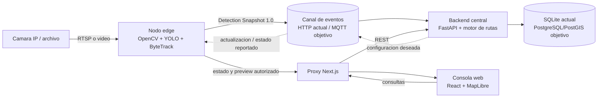
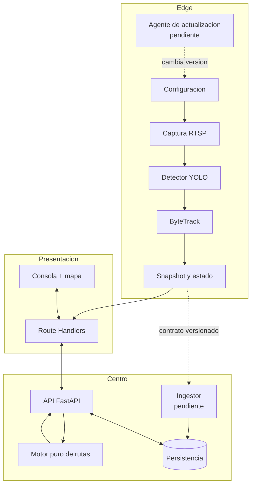
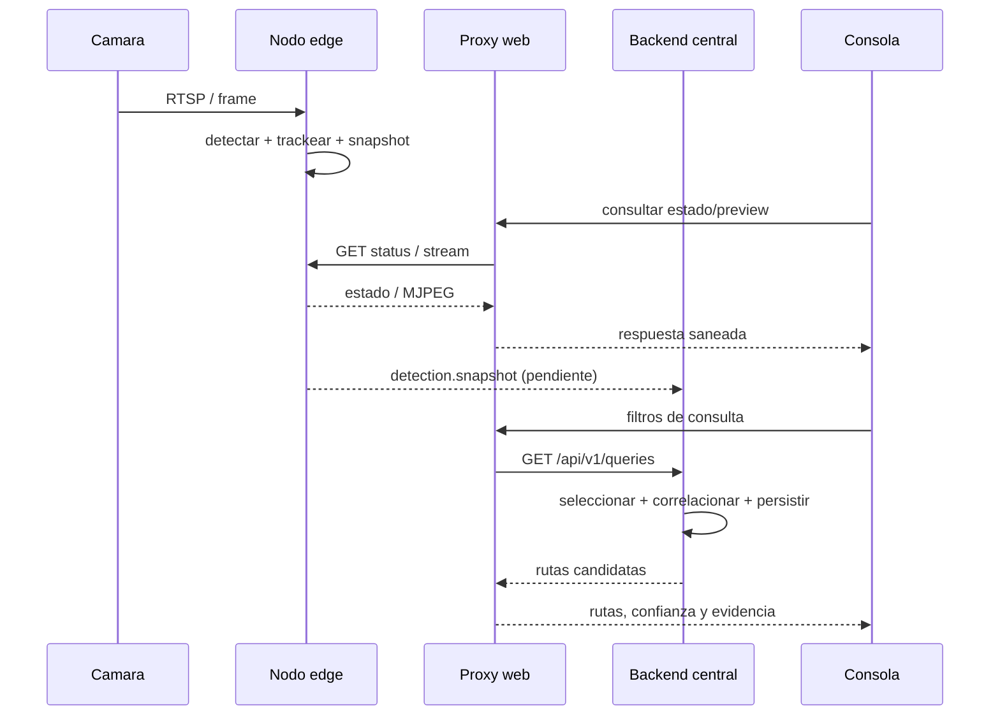
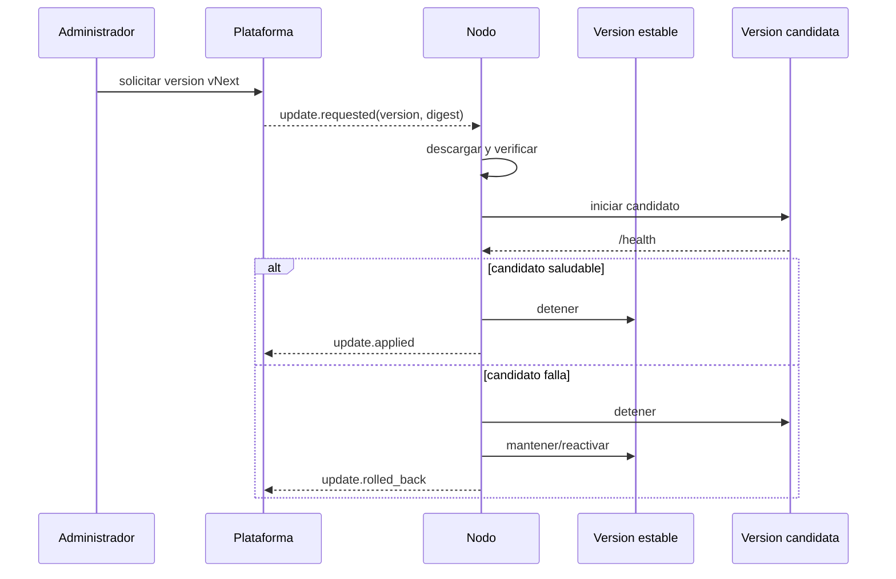

# Segundo informe - VIGIA

## Resumen

VIGIA aborda la dificultad de reconstruir el recorrido probable de un vehículo cuando las cámaras residenciales o comunitarias funcionan como sistemas aislados. La consulta manual de múltiples grabaciones consume tiempo, mientras que la centralización permanente de video aumenta el uso de red, almacenamiento y exposición de datos personales. La propuesta adopta una arquitectura híbrida: cada nodo remoto procesa el video cerca de la cámara y la plataforma central recibe datos normalizados para consultar detecciones y estimar trayectorias, sin presentar el resultado como una identificación infalible.

Durante el semestre se construyó un flujo vertical de prototipo. Un nodo de visión en Python recibe RTSP de una Tapo C110, detecta automóviles y motocicletas con YOLO, mantiene identificadores locales con ByteTrack y expone estado, detecciones y vista procesada mediante FastAPI. Se implementó además un backend central con SQLite, modelos para dispositivos, detecciones, consultas y rutas, y un algoritmo que relaciona observaciones por tipo, color, tiempo, dirección y distancia vial. La consola Next.js consume el backend, muestra las cámaras en MapLibre, permite filtrar búsquedas, compara rutas candidatas y conserva un historial temporal de la sesión.

La validación disponible es preliminar pero reproducible. Las pruebas ejecutadas verificaron ocho casos del nodo de visión, seis casos unitarios de la consola, el lint y la compilación de producción; también se aprobaron cuatro pruebas puras de reconstrucción y una prueba de Haversine. El escenario sintético contiene cuatro cámaras, cuatro recorridos esperados, once detecciones pertenecientes a recorridos y seis observaciones de ruido; una auditoría directa recuperó los cuatro recorridos esperados entre las candidatas. Aún faltan la ingestión automática edge-centro, un mecanismo seguro de actualización y reversión del nodo, autenticación, mensajería MQTT, pruebas de carga, evaluación independiente de rutas y medición de precisión sobre video real.

## Abstract

VIGIA addresses the difficulty of reconstructing a vehicle's likely path when residential or community cameras operate as isolated systems. Manually reviewing recordings is slow, whereas permanently centralizing video increases network usage, storage demands, and personal-data exposure. The proposed solution follows a hybrid architecture: each remote node processes video close to the camera, and a central platform receives normalized metadata to query detections and estimate trajectories without presenting the result as definitive identification.

During the semester, the team implemented a vertical prototype. A Python vision node receives an RTSP stream from a Tapo C110, detects cars and motorcycles with YOLO, maintains local track identifiers through ByteTrack, and exposes status, detections, and processed previews through FastAPI. A central backend using SQLite stores devices, detections, queries, and route candidates, while a reconstruction algorithm correlates observations by vehicle type, color, time, direction, and road distance. A Next.js console consumes the central API, displays cameras with MapLibre, applies search filters, compares ranked route candidates, and keeps an in-memory session history.

The available validation is preliminary but reproducible. Executed checks covered eight vision-node cases, six web unit tests, linting, and a production build; four pure routing tests and one Haversine test also passed. The synthetic scenario contains four cameras, four expected routes, eleven route detections, and six noise observations, and a direct audit recovered all four expected routes among the candidates. Remaining work includes automated edge-to-center ingestion, secure node update and rollback, authentication, MQTT messaging, load testing, independent route evaluation, and accuracy measurement on real video.

---

# 1. Introducción

La videovigilancia urbana y comunitaria suele crecer por agregación: cada vivienda, comercio o institución instala cámaras y conserva sus propios flujos. Aunque esta fragmentación distribuye el costo de captura, también dificulta responder una pregunta transversal, como determinar por cuáles puntos pudo pasar un vehículo dentro de una ventana temporal. Revisar cada cámara por separado no escala y, en ausencia de una identidad fuerte, cualquier correlación debe expresarse en términos de probabilidad y evidencia disponible.

VIGIA propone convertir cámaras heterogéneas en nodos remotos que producen observaciones normalizadas. El nodo identifica clases vehiculares, conserva un seguimiento local durante la permanencia del objeto en la escena y comunica metadatos mínimos. La plataforma central administra dispositivos, selecciona observaciones cercanas en espacio y tiempo y genera varias trayectorias candidatas con un nivel de confianza. Este enfoque se inspira en el procesamiento en el borde: la imagen se analiza cerca de la fuente y el centro coordina información estructurada, reduciendo la necesidad de transmitir video de manera permanente.

El estado actual ya supera una maqueta visual, pero todavía corresponde a un MVP académico. Existe una cámara física integrada, servicios ejecutables, contratos de datos, persistencia, un escenario sintético determinista y una consola operativa. Sin embargo, los componentes no forman aún una red remota administrable de extremo a extremo: falta automatizar la publicación desde el nodo hacia el backend, distribuir configuraciones y actualizaciones, proteger consultas con identidad real y demostrar desempeño bajo carga. Por ello, este informe adopta como meta verificable la validación de nodos actualizables, comunicación edge-centro y estimación de rutas sobre datos generados, no el despliegue de una red real.

# 2. Marco conceptual

El **procesamiento en el borde** o *edge computing* desplaza parte del cómputo desde un centro de datos hacia dispositivos cercanos a la fuente. En VIGIA, el borde recibe RTSP, ejecuta inferencia, seguimiento y preparación de eventos; el centro persiste y correlaciona los resultados. La separación reduce el acoplamiento entre el video y la lógica global: el backend no necesita conocer la contraseña RTSP ni ejecutar el modelo de visión. También permite que una caída central no impida por completo la captura local, siempre que el nodo disponga de almacenamiento temporal y reintentos, capacidades aún pendientes de implementar.

La **detección de objetos** localiza instancias en un fotograma y les asigna clase y confianza. El **seguimiento multiobjeto** relaciona detecciones consecutivas y mantiene un identificador temporal dentro de una cámara. VIGIA utiliza YOLO como detector y ByteTrack como línea base de seguimiento; ByteTrack fue diseñado para asociar incluso cajas de baja confianza que pueden corresponder a objetos parcialmente ocluidos [1]. El `trackId` resultante es local al flujo y no constituye una identidad global: la correlación entre cámaras requiere tiempo, ubicación, apariencia, dirección y, en futuras iteraciones, características adicionales cuidadosamente evaluadas.

La **reconstrucción de trayectoria** se entiende aquí como un problema de generación y ordenamiento de hipótesis. Una detección es compatible con otra si pertenece al mismo tipo y color, ocurre después, no contradice la dirección estimada y exige una velocidad plausible según la distancia vial entre cámaras. El algoritmo devuelve candidatos ordenados, penaliza saltos de 500 metros o más y limita los enlaces a 2 kilómetros. La distancia Haversine sirve para seleccionar cámaras alrededor de una consulta, mientras que `device_links` representa distancias aproximadas por la red vial; PostGIS se reserva para una etapa posterior en la que el volumen justifique índices y consultas espaciales nativas [2].

El **contrato de captura** es la frontera técnica más importante del MVP. Un nodo debe producir un objeto JSON versionado con identificador de cámara, instante UTC, modelo, número de fotograma y una lista de detecciones. Cada detección contiene `trackId`, tipo, confianza, primera y última observación, dirección, caja delimitadora y campos opcionales de color, marca, modelo y placa. La versión `1.0` ya está formalizada en JSON Schema; sin embargo, el backend todavía usa un modelo de detección distinto y no existe un adaptador automático que ingiera estos snapshots.

La **actualización remota** significa cambiar de forma controlada el software, el modelo o la configuración del nodo sin intervenir físicamente el dispositivo. Para el cierre se propone empaquetar el nodo como imagen OCI versionada, publicar un manifiesto firmado con versión y *digest*, descargar la versión candidata, ejecutar una verificación de salud y revertir a la versión anterior si falla. Esta capacidad no está implementada en la fecha de corte; los Dockerfiles actuales sí constituyen una base reproducible, pero no incluyen agente de actualización, firma, canales de despliegue ni *rollback*.

Finalmente, la privacidad no es una característica complementaria sino una restricción de diseño. La Ley 1581 de 2012 aplica a datos personales registrados en bases susceptibles de tratamiento y establece principios, derechos de titulares y deberes de responsables y encargados [3]. La Superintendencia de Industria y Comercio ha señalado que las reglas de protección de datos deben aplicarse a cámaras y sistemas de videovigilancia [4]. En consecuencia, VIGIA debe limitar la finalidad, restringir el acceso, minimizar imágenes, fijar retención, auditar consultas y evitar que una inferencia probabilística se presente como identificación cierta.

# 3. Planteamiento del problema

El problema central consiste en aprovechar observaciones distribuidas para estimar el recorrido probable de un vehículo sin exigir la centralización continua de todos los videos. Las cámaras disponibles no comparten necesariamente fabricante, resolución, reloj, orientación ni plataforma de gestión. A esa heterogeneidad se suma que dos vehículos pueden coincidir en tipo y color, que existen zonas sin cobertura y que el tiempo entre cámaras depende de la vía y del tráfico.

La relevancia del problema es técnica y organizacional. Técnicamente, exige integrar visión por computador, comunicación distribuida, persistencia geoespacial y una interfaz que comunique incertidumbre. Organizacionalmente, una comunidad o institución necesita consultar evidencias de varias fuentes sin administrar manualmente cada dispositivo. La solución solo es útil si conserva trazabilidad, diferencia datos reales de demostraciones y limita el tratamiento a un propósito autorizado.

El problema no se resuelve únicamente aumentando la precisión de un detector. Incluso una detección perfecta dentro de cada cámara deja abierta la asociación entre vistas no superpuestas. Por ello, el MVP debe validar tres capacidades separadas: que un nodo remoto produzca capturas normalizadas y pueda actualizarse; que exista comunicación observable y tolerante a desconexiones con la plataforma central; y que el estimador de rutas pueda compararse contra recorridos esperados de un dataset sintético versionado.

## 3.1 Descripción del problema

La causa inmediata es la operación aislada de las cámaras. Cada sistema conserva grabaciones y estados en una interfaz propia, de modo que una búsqueda transversal obliga a conocer ubicaciones, solicitar acceso y revisar intervalos de video. El costo humano crece con el número de cámaras y con la amplitud de la ventana temporal. Si se intenta resolver el problema enviando todos los flujos a un servidor, aparecen costos de red, almacenamiento y protección de datos que no son razonables para el alcance académico.

Los usuarios potencialmente afectados son operadores autorizados de una comunidad, personal de seguridad institucional y administradores de dispositivos. El operador necesita formular una consulta y entender por qué una ruta fue sugerida; el administrador necesita observar disponibilidad, versión y errores de los nodos; las personas captadas por las cámaras necesitan garantías sobre finalidad, acceso y conservación. El sistema debe equilibrar estas necesidades sin prometer identificación forense ni reemplazar procedimientos legales.

Las principales consecuencias de no resolver el problema son tiempos altos de análisis, resultados difíciles de auditar y decisiones basadas en evidencia incompleta. A su vez, una solución mal diseñada puede producir un riesgo mayor: correlacionar equivocadamente vehículos parecidos, exponer flujos privados o conservar información innecesaria. Por ello, VIGIA presenta varias rutas candidatas, mantiene el concepto de confianza y debe permitir rastrear cada resultado hasta las detecciones que lo originaron.

## 3.2 Restricciones y supuestos de diseño

El prototipo parte de cuatro cámaras físicas o simuladas y de una zona de referencia en Barranquilla. Se considera cercano un enlace vial menor de 500 metros y distante uno entre 500 metros y 2 kilómetros. La velocidad implícita válida se limita inicialmente entre 8 y 70 km/h. Estos valores son parámetros de laboratorio, no normas universales, y deberán calibrarse con datos del lugar de prueba. La ubicación de una detección se aproxima mediante la ubicación fija de la cámara.

La identidad vehicular disponible en el backend es un proxy compuesto por tipo y color. El color aún no lo produce el nodo de visión real y, en el snapshot actual, permanece nulo junto con marca, modelo y placa. La placa se estudia en una tubería separada de detección y posterior OCR, pero no forma parte del criterio de éxito del MVP. Una coincidencia de `trackId` tampoco cruza cámaras, porque ese valor solo tiene sentido dentro del proceso local que sigue un flujo.

Se asume conectividad intermitente y capacidad de cómputo limitada en el borde. El diseño objetivo debe funcionar con CPU para la línea base, permitir GPU en entrenamiento y evitar exponer RTSP a Internet. El MVP no asume alta disponibilidad, sincronización perfecta de relojes ni navegación vial exacta. También se asume que las pruebas con material real se realizarán en escenarios controlados, con autorización y una política explícita de conservación.

## 3.3 Alcance actualizado

El alcance incluye un nodo remoto ejecutable que capture RTSP o video, detecte automóviles y motocicletas, mantenga seguimiento local y publique un formato normalizado. Incluye también una plataforma central modular para administrar dispositivos y detecciones, ejecutar consultas espaciales y temporales, persistir candidatos y exponerlos a una consola web. La demostración debe funcionar con al menos cuatro nodos lógicos, aunque solo uno sea una cámara física.

El alcance se actualiza para incluir como resultado verificable un mecanismo mínimo de actualización del nodo y un protocolo de comunicación definido. En la entrega final, actualizar significa instalar una versión versionada, comprobar su salud y revertir si no arranca; comunicar significa publicar snapshots, estados y acuses con reintento e idempotencia. La implementación puede usar HTTP en la demostración y dejar MQTT como evolución, siempre que los mensajes sean independientes del transporte.

Quedan fuera del alcance el despliegue operativo de una red urbana, la identificación inequívoca de personas o vehículos, el reconocimiento garantizado de placas, la retención masiva de video y la respuesta forense. También quedan fuera la alta disponibilidad multi-región, el enrutamiento calle a calle y una certificación legal. PostGIS, MQTT y OCR son extensiones condicionadas a cerrar primero el flujo medible del MVP.

# 4. Objetivos

El objetivo general actualizado es **diseñar, implementar y validar un MVP distribuido de VIGIA que permita a nodos remotos actualizables publicar detecciones vehiculares normalizadas, a una plataforma central recibirlas y supervisarlas, y a un modelo de correlación estimar rutas candidatas comparables con trayectorias esperadas de un escenario controlado**. La red física extensa deja de ser una promesa del proyecto y se convierte en un contexto futuro de aplicación.

El primer objetivo específico es **implementar y validar un nodo remoto actualizable que capture video, ejecute detección y seguimiento local, y publique snapshots conformes con un contrato versionado**. Su evidencia será una ejecución reproducible, validación automática contra JSON Schema, identificación de versión de software y modelo, instalación de una actualización de prueba, comprobación de salud y reversión ante una versión inválida.

El segundo objetivo específico es **demostrar la comunicación entre nodos remotos y la plataforma central mediante mensajes de detección, estado, configuración y actualización, con trazabilidad, reintento e idempotencia**. La evidencia deberá incluir al menos cuatro nodos lógicos, desconexión y reconexión simuladas, medición de latencia de entrega y ausencia de duplicados lógicos aunque un mensaje sea reenviado.

El tercer objetivo específico es **estimar y ordenar rutas candidatas a partir de recorridos generados, evaluando la salida frente a trayectorias esperadas**. La evaluación debe reportar cobertura top-k, exactitud de secuencia, falsos enlaces, detecciones omitidas, tratamiento de huecos y latencia de consulta. Los escenarios deberán separar generación y evaluación para evitar que las mismas reglas garanticen artificialmente un resultado favorable.

El cuarto objetivo específico es **proporcionar una consola que permita consultar, inspeccionar y exportar resultados sin ocultar su incertidumbre**. La interfaz debe diferenciar servicio central, demostración y cámara física; permitir filtros geográficos y temporales; mostrar varias rutas y sus detecciones; e informar tramos no observados. La exportación debe registrar versión del algoritmo, filtros y origen de datos.

El quinto objetivo específico es **incorporar controles básicos de seguridad, privacidad y mantenibilidad acordes con un prototipo académico**. Esto implica no exponer credenciales RTSP, autenticar operadores antes de un piloto, restringir vistas y descargas, registrar consultas, fijar retención y documentar licencias. El objetivo no equivale a certificación, pero sí exige que los riesgos conocidos tengan una medida y un responsable.

# 5. Estado del arte / soluciones relacionadas

Los NVR tradicionales centralizan grabación y consulta, una solución adecuada cuando las cámaras pertenecen a la misma organización y existe infraestructura común. Frigate representa una variante local orientada a cámaras IP: ejecuta detección de objetos cerca del entorno doméstico, prioriza uso eficiente de recursos y se integra con otros sistemas mediante MQTT [5]. Su foco principal es detección, grabación y automatización local, mientras que VIGIA se concentra en correlacionar metadatos de nodos administrativamente distribuidos y explicar rutas candidatas.

NVIDIA DeepStream ofrece una plataforma madura de analítica acelerada por GPU para fuentes RTSP, seguimiento y múltiples flujos [6]. Su referencia multi-cámara genera metadatos como sensor, fotograma, tiempo, caja, identificador y vector de características, y utiliza un *broker* para alimentar analítica central [7]. Esta arquitectura valida la pertinencia de separar percepción y correlación, pero introduce requisitos de GPU, calibración y una pila mayor que excede el MVP. VIGIA prefiere una línea base CPU, contratos JSON simples y un monolito modular para reducir complejidad temprana.

Los trabajos de seguimiento multiobjeto aportan técnicas para conservar identidades dentro de una cámara. ByteTrack asocia detecciones de alta y baja confianza para reducir trayectorias fragmentadas [1], y Ultralytics permite seleccionarlo mediante configuración en el modo de seguimiento [8]. No obstante, el seguimiento por cámara no resuelve automáticamente la reidentificación entre cámaras. VIGIA reconoce esa frontera y evita reutilizar el `trackId` local como identidad global.

La propuesta se posiciona, por tanto, entre un NVR inteligente y una plataforma industrial de analítica multi-cámara. Comparte con Frigate el procesamiento local y la mensajería desacoplada; comparte con DeepStream la idea de metadatos normalizados y analítica posterior; pero restringe el objetivo a vehículos, cuatro nodos lógicos y evaluación académica reproducible. Su contribución no es un detector nuevo, sino la integración trazable de captura, comunicación, correlación probabilística y visualización bajo restricciones de privacidad.

La elección de componentes abiertos también facilita inspección y sustitución. FastAPI se basa en OpenAPI y JSON Schema, e incorpora validación y documentación interactiva [9]; MapLibre GL JS renderiza mapas vectoriales interactivos en el navegador [10]; Next.js Route Handlers permiten implementar una capa servidor entre el navegador y servicios privados [11]. Estas capacidades se aprovechan sin convertir el framework en el núcleo del dominio: los contratos y el algoritmo de rutas permanecen independientes de la interfaz.

En comparación con soluciones comerciales de lectura de placas o búsqueda forense, VIGIA conserva una ambición más limitada. No se evalúa aquí un servicio externo de ALPR porque la calidad de las placas de la Tapo aún no ha sido establecida y enviar recortes a terceros ampliaría el tratamiento de datos. La estrategia vigente exige primero medir resolución, desenfoque, ángulo y precisión del detector de placas; solo después se decidirá si el OCR aporta valor suficiente.

# 6. Solución propuesta

La solución propuesta es una plataforma híbrida con nodos edge, backend central y consola web. Cada nodo obtiene video de una cámara, ejecuta inferencia y conserva únicamente el estado necesario de los tracks activos. En lugar de entregar la URL RTSP, publica un snapshot JSON y, para supervisión autorizada, un preview procesado. La plataforma central filtra cámaras y observaciones, ejecuta la correlación y guarda consultas y resultados.

Los usuarios objetivo del MVP son dos roles. El operador formula consultas por cámara o punto, radio, fecha, ventana horaria, tipo y color; luego compara rutas, confianza y tramos distantes. El administrador registra nodos, revisa estado, versión, última comunicación y errores, y autoriza actualizaciones. En la implementación actual solo existe un usuario de demostración persistido y no hay autenticación real, por lo cual la separación de roles es todavía un requerimiento.

La propuesta de valor es reducir el trabajo manual y el movimiento innecesario de video, manteniendo explícita la incertidumbre. Una ruta es una hipótesis respaldada por una secuencia de detecciones, no una declaración de identidad. El sistema permite inspeccionar qué cámaras y tiempos formaron el resultado, exportar la consulta y reconocer cuándo un tramo no fue observado.

El formato mínimo de captura será `Detection Snapshot 1.0`. En la fecha de corte ya exige `schemaVersion`, `cameraId`, `generatedAt`, `model`, `frameNumber` y `detections`; cada elemento incluye `trackId`, `vehicleType`, `confidence`, `firstSeen`, `lastSeen`, `direction`, `boundingBox`, `color`, `make`, `model` y `licensePlate`. Para la entrega final se añadirá, mediante una versión compatible o un sobre de mensaje, `eventId`, `nodeVersion`, `modelVersion` y un contador de secuencia que permita deduplicar y auditar.

El mecanismo de actualización objetivo utilizará imágenes de contenedor versionadas. La plataforma publicará una configuración deseada con versión y *digest*; el agente del nodo descargará la imagen, verificará integridad, levantará el candidato, consultará `/health` y confirmará `update.applied`. Si falla, reactivará la versión previa y publicará `update.rolled_back`. La demostración final debe ejecutar este flujo al menos entre dos versiones locales; la firma criptográfica y la distribución por un registro privado podrán simularse si no hay infraestructura institucional.

La comunicación se define por mensajes independientes del transporte: `node.heartbeat`, `detection.snapshot`, `node.status`, `config.desired`, `config.reported`, `update.requested`, `update.applied` y `update.failed`. HTTP servirá para el flujo vertical actual y MQTT 5 se propone para publicación/suscripción, entrega con QoS e independencia entre productores y consumidores; el estándar caracteriza MQTT como un protocolo ligero cliente-servidor de publicación/suscripción, apropiado para entornos M2M e IoT [12].

# 7. Metodología de desarrollo

El proyecto siguió una estrategia incremental orientada a reducir incertidumbre técnica. La primera iteración validó la conexión RTSP de la Tapo C110 y la ejecución local de detección y tracking. La segunda separó el procesamiento en un servicio FastAPI, protegió credenciales mediante un proxy servidor y agregó una vista web. La tercera construyó el modelo central, el algoritmo puro de rutas, el seed de Barranquilla y sus pruebas.

La iteración más reciente integró la consola con el backend y distinguió explícitamente el modo demostración de los datos centrales. Se incorporaron filtros, conversión horaria de Colombia a UTC, varias rutas candidatas, historial de sesión, exportación JSON, estados de carga y errores, diseño adaptable y pruebas de navegador definidas. Paralelamente, se prepararon herramientas para extraer y etiquetar frames de placas, auditar datasets, conservar divisiones temporales y ejecutar entrenamiento reproducible en Azure Machine Learning.

Las decisiones arquitectónicas se documentaron como ADR. Se eligió una arquitectura híbrida y un monolito modular porque los microservicios completos introducirían fallos distribuidos antes de validar el caso de uso. Se eligió SQLite y Haversine para mantener baja la fricción del prototipo, con una ruta de migración a PostgreSQL/PostGIS cuando el volumen de cámaras y detecciones lo justifique. El algoritmo se aisló como función pura para probarlo sin base de datos.

La validación combina pruebas unitarias, integración, compilación y escenarios controlados. En este corte se ejecutaron satisfactoriamente ocho pruebas del nodo de visión, seis pruebas unitarias web, lint y compilación de producción. También se aprobaron cuatro pruebas puras del algoritmo y una prueba geográfica. Las pruebas HTTP del backend están escritas, pero su ejecución completa quedó bloqueada en el entorno local con Python 3.14 y la combinación instalada de TestClient; este hecho se registra como deuda de entorno, no como prueba superada.

La metodología de cierre será guiada por evidencia. Cada objetivo tendrá un escenario, una métrica, un umbral y un artefacto reproducible. Los cambios de algoritmo se medirán sobre una partición que no se use para ajustar parámetros; las pruebas de comunicación inyectarán pérdidas y duplicados; las actualizaciones comprobarán reversión. Los resultados negativos se conservarán porque permiten distinguir las limitaciones reales de una demostración preparada.

El proceso también incorpora revisión de riesgos. Antes de usar video real se verificará consentimiento, finalidad y retención; antes de incorporar pesos de terceros se revisará su procedencia y licencia; antes de exponer previews se implementará autenticación. Esta secuencia evita que una característica técnicamente posible se convierta automáticamente en una característica aceptable para el piloto.

# 8. Requerimientos

Los requerimientos se derivan del problema, los objetivos actualizados y la implementación existente. Se redactan de forma verificable para evitar expresiones como “funcionar correctamente” sin criterio de aceptación. Cada requerimiento tendrá una prueba asociada y una prioridad MoSCoW para la entrega final.

El MVP debe demostrar un flujo completo con datos controlados: nodo, transporte, persistencia, consulta, estimación y presentación. Los componentes opcionales, como OCR y PostGIS, no pueden desplazar las tareas que prueban ese flujo. La trazabilidad debe permitir identificar versión del nodo, versión del modelo, mensaje, detecciones de entrada y ruta de salida.

Los requerimientos no funcionales se aplican de manera proporcional a un prototipo académico. No se exige disponibilidad de producción, pero sí recuperación observable; no se exige una auditoría de seguridad, pero sí secretos fuera del repositorio y control de acceso; no se exige una carga masiva, pero sí medir la carga esperada del MVP y documentar el punto de saturación.

## 8.1 Funcionales

**RF-01 Captura y detección.** El nodo debe aceptar RTSP o archivo, detectar `car` y `motorcycle`, mantener un `trackId` local y estimar dirección. Debe generar snapshots conformes con un esquema versionado y conservar tiempos UTC. Criterio: cien por ciento de los snapshots del conjunto de prueba deben validar contra el contrato.

**RF-02 Estado y comunicación.** El nodo debe publicar latido, estado operativo, versión, último frame, FPS, detecciones activas y códigos de error. La plataforma debe reconocer `stopped`, `loading-model`, `connecting`, `running`, `reconnecting` y `error`, además de diferenciar `online`, `stale` y `offline` según el último latido. Criterio: una desconexión simulada debe reflejarse y una reconexión no debe duplicar detecciones lógicas.

**RF-03 Actualización remota.** Un administrador debe seleccionar una versión, ordenar la actualización y conocer el resultado. El nodo debe verificar el artefacto, aplicar la versión, ejecutar una prueba de salud y revertir ante error. Criterio: una versión válida queda activa y una versión deliberadamente defectuosa produce rollback comprobable.

**RF-04 Persistencia.** El backend debe administrar dispositivos y detecciones, registrar consultas y persistir rutas con su secuencia de observaciones. Cada mensaje debe tener una clave idempotente. Criterio: reenviar el mismo evento no aumenta el conteo lógico y toda ruta puede trazarse hasta sus detecciones.

**RF-05 Consulta.** El operador debe consultar por ubicación o cámara, radio, intervalo, tipo y color. El sistema debe devolver cámaras cercanas, conteo de candidatos y hasta diez rutas ordenadas. Una ventana invertida o coordenadas inválidas debe rechazarse con un mensaje comprensible.

**RF-06 Estimación.** El motor debe excluir pares con tiempos no crecientes, cámaras iguales, identidades proxy distintas, direcciones opuestas, enlaces inexistentes o velocidades fuera del rango. Debe marcar huecos distantes y nunca presentar la primera ruta como certeza. Criterio: los escenarios sintéticos deben reportar exactitud top-k y falsos enlaces.

**RF-07 Visualización y exportación.** La consola debe representar dispositivos, radio, ruta seleccionada, confianza, secuencia temporal, origen de datos y advertencias. Debe ofrecer exportación JSON con parámetros y versión del algoritmo. Criterio: el flujo debe ser usable en escritorio y móvil sin desbordamiento horizontal.

**RF-08 Administración y auditoría.** La plataforma debe autenticar operadores y administradores, aplicar roles y registrar consultas, cambios de configuración y actualizaciones. Criterio: un operador no puede actualizar nodos y un usuario no autenticado no puede acceder a previews ni resultados.

## 8.2 No funcionales

**RNF-01 Rendimiento.** Para la carga esperada de 4 a 10 nodos y una frecuencia de un snapshot cada 1 a 5 segundos, la plataforma debe sostener al menos 10 mensajes por segundo con p95 de ingestión menor de 500 ms en la red de prueba. Las consultas sobre un día de datos del escenario deben responder con p95 menor de 2 segundos. Estos umbrales son propuestos y deben medirse, no asumirse.

**RNF-02 Resiliencia.** El nodo debe almacenar temporalmente mensajes cuando el centro no esté disponible, reintentar con retroceso y conservar el orden por cámara. El backend debe aceptar reenvíos idempotentes. Una caída del preview no debe detener la detección ni la cola local, y una caída central no debe perder eventos dentro de la capacidad configurada.

**RNF-03 Seguridad y privacidad.** Las credenciales RTSP y secretos no deben llegar al navegador ni al repositorio. Todo tráfico remoto debe usar TLS; los previews requieren autenticación; las miniaturas deben ser opcionales y tener retención definida. Las consultas y exportaciones deben quedar auditadas, y placas o rostros no necesarios deben omitirse o protegerse.

**RNF-04 Mantenibilidad.** Los contratos deben versionarse y los cambios incompatibles deben crear una nueva versión. El algoritmo de rutas debe permanecer separado del ORM y la interfaz. Toda entrega debe superar pruebas, lint, compilación y documentación de configuración.

**RNF-05 Portabilidad.** El nodo debe poder ejecutarse en Linux mediante contenedor, con CPU como línea base y GPU opcional. La plataforma central debe poder levantarse en desarrollo sin servicios externos obligatorios. Las rutas y configuraciones no deben depender de una IP o credencial incrustada.

**RNF-06 Usabilidad y explicabilidad.** La interfaz debe mostrar estados vacíos, carga y error; diferenciar demostración de datos centrales; permitir navegación por teclado; y evitar animaciones para usuarios con movimiento reducido. Toda confianza debe acompañarse de las observaciones que la sustentan y de una advertencia cuando existan huecos.

**RNF-07 Observabilidad.** Cada servicio debe exponer salud y métricas mínimas. Los logs deben incluir identificadores de correlación sin secretos. Deben medirse cola pendiente, latencia de ingestión, último latido, FPS, duración de consulta, tasa de error y versión activa.

**RNF-08 Compatibilidad legal y de licencia.** El piloto debe documentar base y finalidad del tratamiento, responsables, avisos, retención y procedimiento de atención a titulares. Antes de distribuir o usar comercialmente el sistema, se revisarán las licencias de Ultralytics, modelos, datasets y mapas. Esta verificación es un entregable, no una presunción.

# 9. Evaluación de alternativas

Se compararon tres alternativas: **A)** centralización de video en un servidor; **B)** arquitectura híbrida con nodos edge y backend modular, seleccionada por VIGIA; y **C)** plataforma industrial GPU multi-stream, representada por DeepStream. La comparación es analítica porque todavía no existe un benchmark común. Los resultados de carga que aparecen son expectativas y riesgos, no mediciones.

La carga esperada del MVP es pequeña: 4 a 10 nodos, 0,2 a 1 snapshot por segundo por nodo y hasta 10 operadores concurrentes. En ese rango, el costo dominante de la alternativa B está en la inferencia local y no en el API central. La alternativa A concentra decodificación e inferencia y escala con el ancho de banda de video; la C ofrece alto throughput en GPU, pero su costo de infraestructura y calibración no se justifica aún.

La alternativa B también ofrece el mejor ajuste al objetivo académico porque permite demostrar fronteras y fallos sin desplegar una plataforma compleja. No es necesariamente la de mayor throughput absoluto: una solución DeepStream bien configurada puede procesar múltiples fuentes con aceleración. La selección se basa en suficiencia, sustituibilidad, privacidad y costo de validación, no en afirmar superioridad universal.

| Criterio | A. Video centralizado | B. Edge + centro modular | C. Plataforma GPU industrial |
|---|---|---|---|
| Latencia crítica | Sensible a red y cola central | Inferencia local; centro procesa metadatos | Baja con GPU, depende de la canalización |
| Throughput esperado | Limitado por decodificación/ancho de banda | Escala agregando nodos; centro recibe mensajes pequeños | Alto, con hardware y configuración especializados |
| Carga concurrente | Un fallo central afecta captura y consulta | Captura local continúa; consulta central se degrada | Buen procesamiento, mayor complejidad operativa |
| Dependencia externa | Servidor y almacenamiento centrales | Tecnologías abiertas; Azure solo para entrenamiento opcional | Dependencia fuerte del ecosistema NVIDIA |
| Acoplamiento interno | Video, inferencia y consulta unidos | Contrato separa edge, backend y web | Plugins separados, pero ligados a la plataforma |
| Sustitución | Costosa | Alta si se conserva el contrato | Posible dentro de interfaces del SDK |
| Fallo parcial | Impacto amplio | Se aísla por nodo o servicio | Aislamiento posible con orquestación |
| Costo para el MVP | Alto en red/almacenamiento | Bajo y gradual | Alto en GPU y aprendizaje operativo |

Respecto al desempeño bajo carga, B es la alternativa con mejor relación entre capacidad y costo esperado. El backend actual recorre dispositivos en memoria para Haversine y ejecuta una búsqueda combinatoria acotada a seis detecciones por ruta y diez candidatos. Esto es suficiente para cuatro cámaras, pero no prueba escalabilidad. El benchmark final debe aumentar nodos, eventos y consultas hasta identificar p95, throughput y saturación.

En acoplamiento, B separa el contrato de detección, la función de rutas y la interfaz. El proxy Next.js evita que el navegador conozca servicios privados, aunque añade un salto HTTP. FastAPI y SQLAlchemy pueden reemplazarse si se mantienen esquemas y semántica; YOLO o ByteTrack también pueden cambiar sin alterar el backend. La principal deuda es que los esquemas edge y backend aún no están unidos por un adaptador versionado.

En disponibilidad, ningún diseño actual ofrece un SLA. La alternativa B permite que cada nodo siga procesando si el centro cae, pero esa ventaja solo será efectiva cuando exista cola local. Los contenedores tienen política de reinicio y el nodo reintenta la cámara, pero no hay broker, réplica de base de datos ni backup automatizado. La tolerancia a fallos debe demostrarse mediante pérdida temporal del backend, reinicio del nodo y actualización fallida.

# 10. Diseño y arquitectura

El diseño adopta separación por responsabilidades y contratos explícitos. El nodo de visión posee la conexión a la cámara y el estado de tracking; el backend posee el historial y la correlación global; la web posee la interacción del operador. Ningún componente debe asumir una identidad vehicular que no esté respaldada por datos.

La arquitectura implementada es parcialmente síncrona. La consola usa Route Handlers para comunicarse por HTTP con visión y backend, y el nodo escribe además un snapshot local. La arquitectura objetivo añade un canal asíncrono de eventos y control, con MQTT o un adaptador equivalente, y una cola local. Esta diferencia se representa explícitamente en los diagramas.

La consistencia se gestiona de forma pragmática. El tiempo se normaliza a UTC, los identificadores internos usan UUID y la consola convierte horarios de Colombia de forma explícita. Para la entrega final, `eventId`, `sequenceNumber` y versión de esquema deberán garantizar deduplicación y orden por cámara, mientras que los comandos de configuración usarán estado deseado y reportado.

## 10.1 Descripción general de la arquitectura

VIGIA es una arquitectura híbrida cliente-servidor con procesamiento edge. El cliente web no se conecta a RTSP; consume una capa servidor de Next.js que valida y reenvía solicitudes. El backend FastAPI centraliza metadatos, no video continuo. El nodo de visión es un servicio autónomo que encapsula OpenCV, YOLO y ByteTrack.

La arquitectura seleccionada corresponde a la alternativa B del capítulo anterior. Se conserva un monolito modular en el centro para evitar desplegar microservicios antes de validar el dominio. Las fronteras se preparan para evolucionar: JSON Schema para detecciones, REST para consulta y mensajes propuestos para estados, configuración y actualización.

El diseño objetivo añade PostgreSQL/PostGIS y MQTT cuando existan razones medibles. PostGIS permitiría usar índices GiST y predicados espaciales en lugar de recorrer todos los dispositivos [2]. MQTT desacoplaría nodos y consumidores y permitiría QoS, pero no sustituye por sí solo idempotencia, seguridad ni persistencia local.

## 10.2 Componentes del sistema

`apps/vision` es el nodo remoto. Configura credenciales desde ambiente, abre el stream con transporte TCP, carga el detector, usa ByteTrack, estima dirección por desplazamiento y conserva tracks durante diez segundos. Expone `/health`, `/api/v1/status`, `/api/v1/detections`, `/api/v1/preview.jpg` y `/api/v1/stream.mjpg`. Puede ejecutar una segunda etapa de detección de placas si se configura un peso especializado, pero no realiza OCR.

`apps/backend` es la plataforma central modular. Sus modelos representan usuarios, dispositivos, enlaces viales, detecciones, consultas, rutas y la relación ordenada entre rutas y detecciones. Los endpoints CRUD administran dispositivos y observaciones; `GET /api/v1/queries` selecciona cámaras por Haversine, filtra por ventana y atributos, ejecuta `reconstruct_routes` y persiste resultados. SQLite es la persistencia actual.

`apps/web` es la consola. Consume dispositivos y consultas por proxies del lado servidor, presenta un mapa de Barranquilla, permite seleccionar cámara, radio, tipo, color, fecha y hora, y muestra hasta varias rutas. El modo demo es explícito y no reemplaza silenciosamente una falla real. El historial conserva veinte consultas en memoria y la exportación JSON informa el origen.

`packages/contracts` contiene el esquema compartido `detection-snapshot-1.0`. `docs/architecture` y `docs/adr` registran límites y decisiones. `azure` y `apps/vision/training` preparan dataset, entrenamiento y evaluación del detector de placas en un clúster GPU que escala a cero cuando no se usa, una capacidad documentada por Azure Machine Learning [13]. Estos componentes soportan experimentación, pero el detector de placas no define el éxito del MVP.

Los componentes pendientes son el adaptador de ingestión, el broker o transporte elegido, la cola local, el agente de actualización, autenticación y observabilidad agregada. También falta incorporar el backend al `compose.yaml`: actualmente el compose levanta web y, opcionalmente, visión, pero no la plataforma central. Esta brecha impide llamar “despliegue integral” al estado actual.

Cada componente se relaciona con requerimientos específicos. Visión cubre RF-01 y parte de RF-02; backend cubre RF-04 a RF-06; web cubre RF-05 y RF-07; contratos soportan RNF-04; Docker contribuye a RNF-05. RF-03, RF-08 y partes de resiliencia, seguridad y observabilidad permanecen pendientes.

## 10.3 Interacción entre módulos

En el flujo de visión, la cámara entrega RTSP al nodo. El worker procesa los frames fuera del ciclo HTTP, actualiza tracks bajo bloqueo, genera un JPEG anotado y construye snapshots. El API solo lee el último estado, por lo que una solicitud web no dispara inferencia nueva. Este desacoplamiento evita que la velocidad del navegador controle la cámara.

En el flujo de consulta, la consola envía filtros a un Route Handler. El proxy valida, convierte la hora de Colombia a UTC, descarta campos desconocidos y limita la espera a diez segundos. El backend persiste la consulta, busca dispositivos dentro del radio, carga enlaces y detecciones, ejecuta el algoritmo y devuelve rutas. La web dibuja líneas entre observaciones y aclara que no representan navegación exacta por calles.

En el flujo objetivo de ingestión, el nodo asignará un `eventId`, guardará el mensaje en una cola local y lo publicará. El centro confirmará la recepción idempotente. Si no hay confirmación, el nodo reintentará; si llega un duplicado, el backend devolverá éxito sin insertar otra detección. El estado reportado seguirá un canal separado para que una ráfaga de detecciones no oculte fallos operativos.

Las dependencias están orientadas hacia contratos. Visión no importa modelos del backend y el motor de rutas no importa el ORM. La web sí conoce la forma de la respuesta central, pero concentra esa traducción en `src/lib` y Route Handlers. La deuda principal es una duplicación semántica: `Detection Snapshot` incluye intervalos y cajas, mientras el modelo central persiste un instante y no almacena el sobre completo.

El nivel de acoplamiento actual es moderado. Cambiar el detector conserva el contrato; cambiar SQLite por PostgreSQL conserva SQLAlchemy; cambiar MapLibre afecta solo presentación. En cambio, cambiar los nombres de dirección o la interpretación de color puede romper edge, backend y web. Por eso, esos enums deben moverse a contratos compartidos versionados y probarse de extremo a extremo.

El siguiente diagrama separa comunicación existente y objetivo. Las flechas continuas están implementadas; las discontinuas representan trabajo pendiente. Esta convención evita presentar MQTT y actualizaciones como funcionalidades terminadas.

## 10.4 Comportamiento

El flujo de procesamiento es eficiente para el MVP porque el worker conserva el último frame y snapshot, y el API no reabre la cámara por cliente. El MJPEG envía cada versión una vez por consumidor. El principal cuello de botella es la inferencia CPU, seguida por codificación JPEG; por ello, el preview debe ser de supervisión y no un requisito para la publicación de metadatos.

El backend actual funciona para pocos dispositivos, pero `find_nearby_devices` carga todas las cámaras y calcula Haversine en Python. La reconstrucción usa búsqueda en profundidad dentro de grupos tipo-color; aunque limita longitud y candidatos, puede crecer con muchas detecciones semejantes. Los índices actuales por dispositivo, tiempo, tipo y color ayudan a filtrar, pero una escala mayor requerirá PostGIS, ventanas más estrechas y posiblemente un grafo dinámico o búsqueda por haces.

La interacción refleja buen desacoplamiento en el algoritmo, el acceso RTSP y el proxy, pero es incompleta en resiliencia. No existe *store-and-forward*, confirmación de ingestión ni circuito de actualización. La secuencia de cierre debe probar esos comportamientos antes de optimizar detalles visuales u OCR. Un nodo debe seguir detectando durante una caída central y enviar después lo pendiente sin alterar el orden lógico.

# 11. Implementación y avance actual

El repositorio contiene tres aplicaciones, contratos, documentación y configuración de entrenamiento. La rama local parte del commit `7ea9098` de `develop`, con cambios no confirmados que amplían la consola, el etiquetado de placas y Azure. Por tanto, el informe registra el estado del directorio de trabajo, no solo lo publicado en la rama remota.

El avance más importante es la existencia de un flujo demostrable desde datos centrales hasta la interfaz. El backend puede sembrar cámaras y detecciones, calcular rutas y devolverlas; la web puede consultar el API, representar alternativas y exportar resultados. En paralelo, el nodo físico puede procesar la Tapo y entregar preview, pero aún no publica sus snapshots al backend automáticamente.

La implementación conserva varias decisiones saludables: secretos en ambiente, contratos independientes, algoritmo puro, seed determinista, mensajes de error saneados en el proxy y documentación de límites. Las brechas más críticas no son cosméticas: actualización remota, ingestión, autenticación y validación independiente. Estas tareas concentran el plan de cierre.

## 11.1 Stack tecnológico

El nodo y el backend usan Python. FastAPI proporciona endpoints, validación basada en tipos, OpenAPI y documentación interactiva [9]; SQLAlchemy modela la persistencia; OpenCV captura y codifica; Ultralytics ejecuta YOLO y ByteTrack. El contenedor de visión se basa en Python 3.12 y una distribución CPU de PyTorch, mientras que el entorno local analizado usa Python 3.14.

La consola utiliza Next.js 16.3.1, React 19.2.8, TypeScript 5 y MapLibre GL JS 6.x. Los Route Handlers actúan como backend para el frontend y permiten que URLs y errores internos permanezcan del lado servidor [11]. ESLint valida el código, el ejecutor nativo de Node cubre pruebas unitarias y Playwright define escenarios de navegador.

La persistencia actual es SQLite; PostgreSQL/PostGIS permanece como evolución. Docker y Compose reproducen web y visión, aunque el backend todavía no está incluido. Azure Machine Learning se prepara para entrenamiento de placas con una GPU T4, máximo un nodo, mínimo cero y apagado tras 120 segundos; esta configuración controla costo, pero requiere cuota y un dataset privado correctamente versionado.

## 11.2 Componentes implementados

El nodo de visión implementa configuración segura, codificación de credenciales RTSP, reconexión, carga del modelo, detección de `car` y `motorcycle`, ByteTrack, dirección, retención temporal de tracks, snapshots atómicos, preview JPEG, MJPEG y estado con códigos de error. La segunda etapa de placas detecta dentro de recortes vehiculares y guarda una captura por track cuando existe un peso compatible. Color, marca, modelo y texto de placa continúan nulos.

El backend implementa siete tablas, CRUD de dispositivos y detecciones, selección geográfica, enlaces viales, seed, algoritmo y endpoint de consultas. El algoritmo agrupa por tipo y color, comprueba orden temporal, dirección y velocidad, calcula score por segmento, penaliza huecos distantes, deduplica subsecuencias y limita los candidatos. Las rutas y su orden de detecciones se persisten.

La consola implementa mapa, listado y búsqueda de cámaras, radio visible, filtros, conversión de zona horaria, resultados múltiples, confianza, detecciones, advertencias de huecos, historial de sesión, exportación, preview de cámara, modo demo explícito, estados de error, responsividad y accesibilidad básica. Los endpoints de etiquetado permiten navegar frames y guardar anotaciones de placas en un dataset local.

## 11.3 Integraciones realizadas

La integración cámara-nodo se validó mediante RTSP con una Tapo C110. El nodo mantiene las credenciales solo en ambiente y usa TCP para FFmpeg/OpenCV. El preview llega al navegador mediante FastAPI y un proxy Next.js, de modo que la URL RTSP no se expone al cliente.

La integración web-backend consume dispositivos y consultas centrales. El proxy normaliza fechas, aplica lista permitida de parámetros, deshabilita caché, limita tiempo de espera y transforma errores sin filtrar trazas internas. La consola no sustituye automáticamente una consulta fallida con datos demo, lo cual conserva la integridad de la evidencia.

La integración con Azure está preparada como infraestructura declarativa, no validada como entrenamiento terminado. Existen scripts para extraer frames, importar YOLO de Roboflow, auditar cajas, conservar splits de manifiesto, construir el dataset y entrenar. El trabajo con placas debe reportarse como preparación experimental hasta que exista ejecución, métricas y peso evaluado sobre test independiente.

## 11.4 Pendientes para la entrega final

La prioridad uno es cerrar el flujo edge-centro: adaptador del snapshot al modelo central, `eventId`, idempotencia, cola local, reintentos y estados de comunicación. Sin esto, la cámara física y la reconstrucción central son dos demostraciones conectadas solo por arquitectura documental. El escenario final debe usar al menos un nodo real y tres simulados bajo el mismo contrato.

La prioridad dos es construir la actualización remota mínima y la seguridad de acceso. Se requiere versionar nodo y modelo, aplicar una actualización, verificar salud, revertir una falla, autenticar usuarios y proteger preview, consultas y comandos. También se debe incluir backend en Compose, agregar migraciones y definir retención y backup para el entorno de demostración.

La prioridad tres es completar la evaluación. Se necesita un ground truth externo al algoritmo, más recorridos ambiguos y negativos, pruebas de carga, recuperación ante desconexión y pruebas end-to-end estables. La evaluación de placas es secundaria: solo debe continuar si la calidad de recortes demuestra que el OCR es viable sin desviar esfuerzo de los objetivos centrales.

# 12. Despliegue y operación preliminar

La solución se ejecuta actualmente en desarrollo local. El backend se inicia con un entorno Python, instala requerimientos, genera el seed y expone Uvicorn en el puerto 8000. El nodo de visión usa otro entorno Python, configuración `.env` y Uvicorn en el puerto 8001. La consola instala dependencias npm y corre en el puerto 3000.

Docker reproduce la consola y, mediante el perfil `vision`, el nodo de cámara. La imagen de visión instala FFmpeg, librerías gráficas, PyTorch CPU y dependencias; define un *healthcheck* y monta `outputs`. La imagen web usa etapas de dependencias, compilación y ejecución. El archivo Compose todavía no levanta backend ni una base central, por lo que la operación completa requiere procesos manuales.

La cámara debe estar en la misma red local y disponer de una cuenta RTSP/ONVIF. `stream2` reduce ancho de banda para detección general y `stream1` ofrece mayor resolución para evaluar placas. El puerto 554 no debe exponerse a Internet; cualquier acceso remoto debe usar una red privada o túnel seguro. Los pesos, videos, datasets, capturas y `.env` están excluidos de Git.

La operación preliminar carece de instalación remota automatizada. Para el cierre se propone un paquete de despliegue por nodo con identificador, endpoint central, credenciales de dispositivo, versión deseada y límites de cola. El operador no deberá editar manualmente el contenedor durante una actualización. Cada cambio producirá un registro de inicio, verificación, resultado y versión activa.

El entrenamiento de placas puede ejecutarse localmente o como un *command job* en Azure ML. El dataset se carga como activo privado y el resultado se descarga como artefacto; el clúster escala a cero cuando está inactivo [13]. La ejecución debe guardar commit, datos, hiperparámetros, métricas y peso para que la comparación sea reproducible.

Antes de un piloto, la operación necesita una lista de verificación: hora sincronizada, credenciales únicas, TLS, usuarios, política de retención, copia de seguridad, prueba de restauración, espacio disponible, temperatura del nodo, estado de cámara y versión. El MVP puede simular algunos controles, pero debe documentar cuáles no están presentes.

# 13. Validación preliminar

La validación se realizó sobre el corte local del 23 de septiembre de 2026. Se ejecutaron pruebas disponibles sin modificar el producto. La consola superó sus seis pruebas unitarias, ESLint y la compilación Next.js de producción; el nodo de visión superó ocho pruebas con `unittest`; el backend superó cuatro pruebas puras de rutas y una prueba de Haversine.

El escenario sintético define cuatro cámaras, seis pares con distancia vial, cuatro vehículos virtuales y seis observaciones de ruido. Los cuatro recorridos esperados son CAM-01→CAM-02, CAM-03→CAM-04, CAM-01→CAM-03→CAM-04 y CAM-01→CAM-02→CAM-03→CAM-04. La auditoría directa encontró todos dentro de los candidatos: los dos autos blancos ocuparon rangos 1 y 2, y las rutas gris y motocicleta ocuparon rango 1 en sus grupos.

Este resultado equivale a una cobertura exploratoria top-10 de 4/4 sobre el seed, pero no debe reportarse como precisión general. Los tiempos sintéticos se generan a partir de las mismas distancias y velocidad urbana usadas por el algoritmo, lo que produce una dependencia circular. La validación final debe introducir variación independiente, errores de reloj, pérdidas, desvíos y vehículos similares para medir generalización.

## 13.1 Pruebas por componentes

En visión se verificaron codificación de credenciales RTSP, cálculo de dirección, forma pública del snapshot, encapsulado MJPEG, nombres válidos de clase de placa, rangos temporales, conservación de splits y auditoría de importación YOLO. Ocho de ocho casos ejecutados terminaron correctamente. No se midieron FPS, precisión del detector ni estabilidad de una sesión RTSP prolongada en esta corrida.

En rutas se verificaron una ruta cercana clara, penalización de huecos distantes, separación de dos vehículos similares en ventanas diferentes y ordenamiento de varias estimaciones. Cuatro de cuatro casos pasaron. Haversine también ubicó el par cercano dentro del rango esperado. Las pruebas no cubren explosión combinatoria, relojes desincronizados, enlaces faltantes, colores nulos masivos ni calibración de confianza.

En web se verificaron zona horaria, validación de entradas, filtros demo, normalización del proxy, manejo de indisponibilidad y preservación visible de fallos del backend. Seis de seis pruebas pasaron; lint y `next build` finalizaron correctamente. Los casos Playwright están definidos para escritorio y móvil, pero no se ejecutaron en este corte, por lo cual sus aserciones no se contabilizan como evidencia superada.

## 13.2 Pruebas de integración

El repositorio contiene pruebas de integración para CRUD y el endpoint de consultas con SQLite en memoria. Durante la revisión, la ejecución de esos casos se detuvo indefinidamente al realizar solicitudes con `TestClient` en Python 3.14, aunque la recolección y las pruebas puras funcionaron. La combinación instalada emitió además una advertencia de deprecación de TestClient. Debe fijarse una versión soportada, preferiblemente la Python 3.12 del Dockerfile, y ejecutar la suite en CI.

La integración web-backend sí está cubierta parcialmente por dobles de `fetch` y por la compilación. Se confirmó que los filtros autorizados llegan al API, que las horas se convierten a UTC y que una falla central produce un error visible en vez de datos ficticios. Falta una prueba viva que levante backend, seed y web juntos y verifique una consulta completa.

La integración cámara-nodo fue validada previamente según la documentación del proyecto, y el código contiene reconexión y estado. No se repitió una sesión con la cámara durante esta auditoría y no se dispone de un registro cuantitativo de duración, FPS, pérdida de frames o exactitud. La entrega final debe producir ese registro y enlazarlo con eventos efectivamente ingeridos por el centro.

## 13.3 Pruebas de usabilidad

La interfaz incorpora medidas observables de usabilidad: etiquetas, estados de carga y error, modo demo identificado, navegación por teclado, diseño adaptable, reducción de movimiento y advertencias sobre rutas. Las pruebas Playwright definidas comprueban flujo demo, filtros, selección, exportación, historial, radio, errores centrales y filtrado de cámaras. Esta cobertura planeada es adecuada, pero requiere una ejecución registrada.

La próxima prueba con usuarios debe incluir al menos cinco participantes ajenos al desarrollo y tres tareas: encontrar cámaras dentro de un radio, comparar dos rutas y exportar la evidencia correcta. Se medirán éxito sin ayuda, tiempo, errores, comprensión de confianza y percepción de certeza. Una pregunta crítica será si el usuario interpreta una línea del mapa como calle exacta; si ocurre, la interfaz debe reforzar la representación de tramo no observado.

La accesibilidad debe revisarse con teclado, contraste y lector de pantalla, además de los chequeos automatizados. Las métricas de confianza no deben depender solo de color. Los mensajes deben evitar lenguaje acusatorio o de identificación, usar “candidato” y “coincidencia probable”, y mostrar origen real, simulado o demo en todo momento.

# 14. Resultados parciales y discusión

El primer resultado es que la arquitectura puede materializarse con componentes pequeños y comprensibles. La cámara física, el nodo de visión, el backend y la consola existen como módulos separados. El contrato y los ADR reducen ambigüedad, y el algoritmo puro permite experimentar sin desplegar la base. Esto demuestra factibilidad técnica inicial, no preparación operativa.

El segundo resultado es que el escenario sintético permite observar comportamientos relevantes: cámaras cercanas, huecos distantes, vehículos parecidos separados en el tiempo, rutas largas y ruido. El motor recupera las cuatro trayectorias esperadas en la auditoría exploratoria y asigna menor confianza a una ruta distante. La principal debilidad es que la generación usa los mismos supuestos de velocidad y enlaces, por lo que la prueba favorece al algoritmo.

El tercer resultado es una mejora significativa de la consola. La interfaz ya no depende únicamente de datos simulados, distingue el origen, normaliza la hora local y presenta errores sin ocultarlos. Esta transparencia es especialmente valiosa en un sistema probabilístico. El historial, sin embargo, vive solo en memoria y el usuario central sigue siendo ficticio.

El cuarto resultado es que el nodo posee un contrato detallado y estados útiles, pero aún no satisface la idea completa de “nodo remoto actualizable”. Docker aporta repetibilidad, no administración remota. Para cerrar el objetivo se requiere un control explícito de versión, artefactos verificables, canal de comando, prueba de salud y rollback. Esta tarea tiene más valor académico que añadir otra clase de detección.

El quinto resultado es que la comunicación distribuida está diseñada pero no implementada. HTTP resuelve consultas y supervisión, mientras MQTT figura como hito. La ausencia de ingestión impide medir pérdida, duplicados y latencia edge-centro. Por ello, el proyecto debe priorizar el mensaje mínimo y la cola antes de migrar la base a PostGIS.

En conjunto, el proyecto se encuentra en una fase de integración avanzada para un prototipo, pero no en fase de despliegue. La evidencia permite afirmar que los módulos principales y la ruta sintética son viables; no permite afirmar 80 % de detección real, disponibilidad, capacidad bajo carga ni cumplimiento integral. El valor del cierre estará en transformar estas afirmaciones pendientes en experimentos reproducibles.

# 15. Plan de cierre hacia la entrega final

La primera semana debe congelar contratos y entorno. Se definirá `Detection Envelope 1.1` con idempotencia, versión del nodo y secuencia; se alineará con el modelo central; se fijará Python 3.12 en CI; y se incorporará backend a Compose. La salida será un arranque de tres servicios con una prueba viva y documentación única.

La segunda semana debe implementar ingestión y resiliencia. Un nodo real y tres simulados publicarán snapshots; el nodo conservará una cola local; el backend deduplicará; y se medirán latencia, reintentos y recuperación tras cinco minutos de desconexión. MQTT puede usarse si cabe en el tiempo, pero un endpoint HTTP confiable con el mismo contrato es aceptable para validar el objetivo.

La tercera semana debe implementar actualización y seguridad mínima. Se construirán dos versiones de nodo, una válida y otra defectuosa, y se demostrará actualización y rollback. Se añadirá autenticación, roles de operador/administrador y protección de preview y consultas. También se definirá retención y limpieza de eventos de prueba.

La cuarta semana debe fortalecer datos y métricas. El seed se exportará como dataset versionado con ground truth independiente, se añadirán al menos cincuenta recorridos, casos negativos, variación temporal y pérdidas. Se medirán top-1, top-3, top-10, exactitud de secuencia, falsos enlaces y latencia. Los parámetros se ajustarán en train/validación y se reportará una sola evaluación final sobre test.

La quinta semana debe ejecutar pruebas de carga, cámara y usabilidad. Se medirán 4, 10 y 25 nodos simulados, consultas concurrentes y punto de saturación; se registrará una sesión de cámara con FPS y calidad; y cinco usuarios realizarán tareas. Las fallas se clasificarán por severidad y solo se corregirán primero las que afecten objetivos, integridad o seguridad.

La semana final debe congelar versión, repetir todas las pruebas, generar evidencias y cerrar documentación. Los riesgos principales son tiempo insuficiente para MQTT, incompatibilidad del entorno Python, calidad insuficiente de video y ampliación de alcance por placas. La mitigación es mantener transporte intercambiable, usar contenedores, conservar el dataset sintético como base de evaluación y tratar OCR como opcional.

| Prioridad | Entregable | Evidencia de aceptación |
|---|---|---|
| P0 | Ingestión edge-centro | Evento real visible en backend y consola |
| P0 | Dataset con ground truth | Versión, splits y métricas repetibles |
| P0 | Actualización y rollback | Dos versiones y falla recuperada |
| P0 | Auth y control de acceso | Pruebas por rol y preview protegido |
| P1 | Resiliencia | Desconexión, cola, reenvío sin duplicados |
| P1 | Carga | p50/p95, throughput y saturación |
| P1 | E2E en CI | Compose + seed + consulta + UI |
| P2 | PostGIS/MQTT completos | Solo si P0 y P1 están cerrados |
| P2 | OCR de placas | Solo si recortes y evaluación lo justifican |

# 16. Referencias

1. Zhang, Y. et al. (2022). *ByteTrack: Multi-Object Tracking by Associating Every Detection Box*. ECCV. <https://arxiv.org/abs/2110.06864>
2. PostGIS Project. (2026). *PostGIS Manual - Spatial Indexes*. <https://postgis.net/docs/postgis-en.html#id-1.5.6.12>
3. Congreso de Colombia. (2012). *Ley 1581 de 2012: disposiciones generales para la protección de datos personales*. <https://www.funcionpublica.gov.co/eva/gestornormativo/norma.php?i=49981>
4. Superintendencia de Industria y Comercio. (2023). *Tratamiento de datos personales a través de cámaras de videovigilancia*. <https://sedeelectronica.sic.gov.co/publicaciones/boletin-juridico/concepto/tratamiento-de-datos-personales-traves-de-camaras-de-videovigilancia>
5. Frigate. (2026). *Introduction*. <https://docs.frigate.video/>
6. NVIDIA. (2026). *DeepStream Overview*. <https://docs.nvidia.com/metropolis/deepstream/8.0/text/DS_Overview.html>
7. NVIDIA. (2026). *Multi-Camera Tracking Reference Application*. <https://docs.nvidia.com/mms/text/MDX_Multi_Camera_Tracking_App.html>
8. Ultralytics. (2026). *Multi-Object Tracking with Ultralytics YOLO*. <https://docs.ultralytics.com/modes/track/>
9. FastAPI. (2026). *Features*. <https://fastapi.tiangolo.com/features/>
10. MapLibre. (2026). *MapLibre GL JS Documentation*. <https://maplibre.org/maplibre-gl-js/docs/>
11. Next.js. (2026). *Route Handlers*. <https://nextjs.org/docs/app/getting-started/route-handlers>
12. OASIS. (2019). *MQTT Version 5.0*. <https://docs.oasis-open.org/mqtt/mqtt/v5.0/mqtt-v5.0.html>
13. Microsoft. (2026). *Create compute clusters - Azure Machine Learning*. <https://learn.microsoft.com/en-us/azure/machine-learning/how-to-create-attach-compute-cluster?view=azureml-api-2>
14. VIGIA. (2026). [Primer informe](./PrimerInforme.md).
15. VIGIA. (2026). [Arquitectura del sistema](./docs/architecture/overview.md).
16. VIGIA. (2026). [ADR-001: plataforma central modular y nodos edge](./docs/adr/001-hybrid-edge-architecture.md).
17. VIGIA. (2026). [ADR-002: backend central, modelo de datos y reconstrucción de rutas](./docs/adr/002-backend-central.md).
18. VIGIA. (2026). [Modelo de datos del backend](./docs/architecture/data-model.md).
19. VIGIA. (2026). [Estrategia para detectar y leer placas](./docs/modeling/license-plates.md).
20. VIGIA. (2026). [Contrato Detection Snapshot 1.0](./packages/contracts/detection-snapshot.schema.json).
