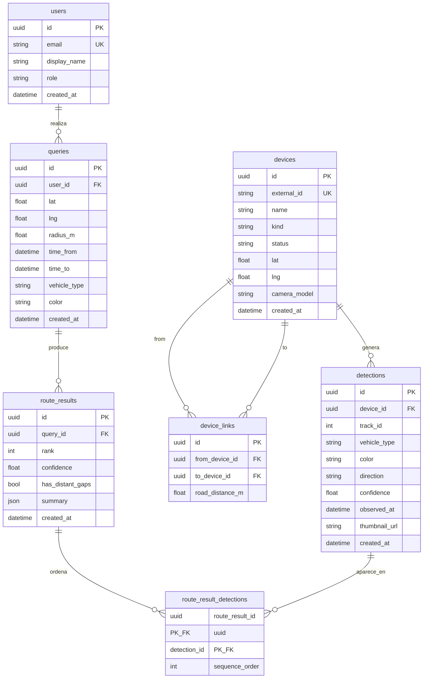

# Propuesta de modelo de datos — backend central

Stack acordado: Python + FastAPI en `apps/backend/` (monolito modular; ver [ADR-002](../adr/002-backend-central.md)).  
Implementado: tablas SQLAlchemy, CRUD de `devices`/`detections`, seed Barranquilla, algoritmo puro de rutas y `GET /api/v1/queries`.

## Criterios

Tomados de [PrimerInforme.md](../../PrimerInforme.md) y de los requisitos del backend:

- Administración básica de **usuarios**, **dispositivos** e **historial de consultas**.
- Detecciones con tipo, color, dirección, fecha/hora y ubicación vía cámara.
- Resultados de trayectoria como **varias rutas candidatas** con score, no una sola certeza.
- `thumbnail` / miniatura **nullable** (aún no se decide si se envían imágenes).
- Sin campos operativos de placa, marca o modelo en este prototipo (fase aparte).
- Persistencia SQL simple ahora; PostGIS después. Coordenadas como `lat`/`lng` (Haversine en aplicación).

## Diagrama de relaciones

## Tablas y columnas

### `users`

Administración básica de acceso y autoría de consultas.

| Columna | Tipo | Nulo | Notas |
|---|---|---|---|
| `id` | UUID | no | PK |
| `email` | TEXT | no | único |
| `display_name` | TEXT | no | |
| `role` | TEXT | no | `admin` \| `operator` (valores iniciales) |
| `created_at` | TIMESTAMPTZ | no | |

Sin contraseñas en esta iteración (auth llega después, según overview). El seed puede crear un usuario `operator` de demostración.

### `devices`

Cámaras (físicas o simuladas). La ubicación de una detección es la de su dispositivo.

| Columna | Tipo | Nulo | Notas |
|---|---|---|---|
| `id` | UUID | no | PK interno |
| `external_id` | TEXT | no | único; p. ej. `CAM-01` (alineado con edge/web) |
| `name` | TEXT | no | p. ej. `Tapo C110`, `Calle 84` |
| `kind` | TEXT | no | `physical` \| `simulated` |
| `status` | TEXT | no | `online` \| `offline` \| `simulated` |
| `lat` | DOUBLE | no | WGS84 |
| `lng` | DOUBLE | no | WGS84 |
| `camera_model` | TEXT | sí | p. ej. `Tapo C110`; null en simuladas |
| `created_at` | TIMESTAMPTZ | no | |

Índice sugerido: `(lat, lng)` no espacial por ahora; filtrado Haversine en código.

### `device_links`

Distancias **por red vial** entre pares de cámaras (no Haversine). Necesario para el seed Barranquilla (2 cercanas &lt; 500 m vial, 2 entre 500 m–2 km) y para el algoritmo de velocidad implícita / penalización de huecos, sin PostGIS.

| Columna | Tipo | Nulo | Notas |
|---|---|---|---|
| `id` | UUID | no | PK |
| `from_device_id` | UUID | no | FK → `devices` |
| `to_device_id` | UUID | no | FK → `devices` |
| `road_distance_m` | DOUBLE | no | metros por red vial; simétricos se insertan en ambas direcciones o se consulta min(a→b, b→a) |

Único: `(from_device_id, to_device_id)`.

### `detections`

Registro central de una observación vehicular. Sin placa/marca/modelo.

| Columna | Tipo | Nulo | Notas |
|---|---|---|---|
| `id` | UUID | no | PK |
| `device_id` | UUID | no | FK → `devices` |
| `track_id` | INTEGER | sí | track local del nodo; útil al ingerir snapshots |
| `vehicle_type` | TEXT | no | `car` \| `motorcycle` (mismo enum del contrato edge) |
| `color` | TEXT | sí | categoría general; null si desconocido |
| `direction` | TEXT | no | mismos valores del contrato: `izquierda-a-derecha`, `derecha-a-izquierda`, `arriba-a-abajo`, `abajo-a-arriba`, `indeterminada` |
| `confidence` | DOUBLE | no | 0–1 |
| `observed_at` | TIMESTAMPTZ | no | instante de la detección (usar `lastSeen` del edge si hay intervalo) |
| `thumbnail_url` | TEXT | sí | **nullable a propósito**; null = solo datos descriptivos |
| `created_at` | TIMESTAMPTZ | no | |

Índices sugeridos: `(device_id, observed_at)`, `(vehicle_type, color, observed_at)`.

**Fuera de alcance (no columnas):** `make`, `model`, `license_plate`. Si el edge los envía null, el backend los ignora en esta versión.

### `queries`

Historial de consultas autorizadas (administración de datos del informe).

| Columna | Tipo | Nulo | Notas |
|---|---|---|---|
| `id` | UUID | no | PK |
| `user_id` | UUID | no | FK → `users` |
| `lat` | DOUBLE | no | punto de interés |
| `lng` | DOUBLE | no | |
| `radius_m` | DOUBLE | no | radio Haversine para dispositivos candidatos |
| `time_from` | TIMESTAMPTZ | no | ventana temporal |
| `time_to` | TIMESTAMPTZ | no | |
| `vehicle_type` | TEXT | sí | filtro opcional |
| `color` | TEXT | sí | filtro opcional |
| `created_at` | TIMESTAMPTZ | no | |

### `route_results`

Una fila por **ruta candidata**. Una consulta produce N filas (nunca se asume una sola respuesta certera).

| Columna | Tipo | Nulo | Notas |
|---|---|---|---|
| `id` | UUID | no | PK |
| `query_id` | UUID | no | FK → `queries` |
| `rank` | INTEGER | no | 1 = mejor score relativo |
| `confidence` | DOUBLE | no | 0–1; baja si hay tramos distantes/con huecos |
| `has_distant_gaps` | BOOLEAN | no | true si algún tramo usa enlace &gt; ~500 m vial |
| `summary` | JSON/TEXT | sí | metadatos ligeros (p. ej. lista de `external_id` en orden); no sustituye la tabla puente |
| `created_at` | TIMESTAMPTZ | no | |

### `route_result_detections`

Orden de detecciones dentro de una ruta candidata.

| Columna | Tipo | Nulo | Notas |
|---|---|---|---|
| `route_result_id` | UUID | no | PK compuesta, FK → `route_results` |
| `detection_id` | UUID | no | PK compuesta, FK → `detections` |
| `sequence_order` | INTEGER | no | 0..n-1 |

## Decisiones de diseño (para ADR-002 más adelante)

1. **Stack:** Python + FastAPI, monolito modular.
2. **Geo:** `lat`/`lng` + Haversine en app; `device_links.road_distance_m` para red vial del prototipo; PostGIS diferido.
3. **Identidad de vehículo:** proxy `vehicle_type` + `color` (sin placa).
4. **Thumbnail:** solo `thumbnail_url` nullable; el modelo no exige ni prohíbe imágenes.
5. **Múltiples rutas:** `route_results` 1:N por `query`, con `confidence` y `has_distant_gaps`.

## Persistencia inicial sugerida (implementación posterior)

- SQLite en desarrollo local (cero fricción) **o** Postgres en `compose.yaml` sin extensión PostGIS.
- ORM: SQLAlchemy 2 / SQLModel, migraciones Alembic cuando se apruebe este esquema.

## Qué no incluye esta propuesta

- MQTT, auth real, ingesta en vivo desde nodos edge.
- OCR / placa / marca / modelo.
- Geometría PostGIS o routing OSRM.
