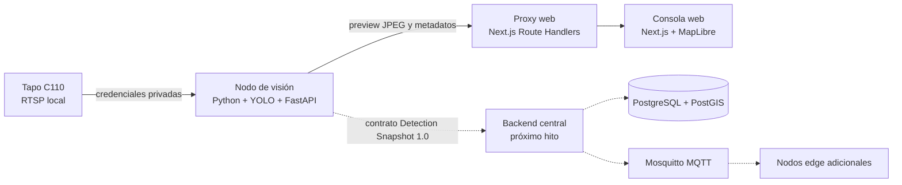

# Arquitectura de VIGIA

## Enfoque

VIGIA utiliza una arquitectura híbrida: nodos edge autónomos procesan video localmente y una plataforma central coordina consultas, consolida resultados y presenta rutas. El prototipo actual implementa la consola web y un primer nodo físico; el backend central se añadirá cuando el flujo cámara–visión–web esté validado.

## Límites de los componentes

| Componente | Responsabilidad | No debe hacer |
|---|---|---|
| `apps/vision` | Capturar RTSP, ejecutar detección/tracking y publicar resultados locales | Exponer credenciales, administrar usuarios o construir rutas globales |
| `apps/web` | Mostrar dispositivos, consultas, preview y trayectorias | Conectarse directamente a RTSP o ejecutar modelos de visión |
| `packages/contracts` | Definir mensajes estables entre componentes | Contener lógica de negocio o secretos |
| Backend futuro | Autorización, consultas distribuidas, consolidación y rutas | Procesar continuamente el video de todas las cámaras |

## Flujo implementado

1. La C110 entrega `stream2` mediante RTSP dentro de la red local.
2. El nodo de visión abre el stream con OpenCV y ejecuta YOLO + ByteTrack.
3. El worker conserva el último frame anotado y un snapshot de detecciones.
4. FastAPI expone únicamente estado, metadatos y preview; nunca la URL RTSP.
5. Route Handlers de Next.js actúan como proxy para que el navegador tampoco conozca la dirección del nodo edge.

## Reglas de seguridad

- `.env`, pesos, videos y resultados generados no se versionan.
- RTSP se usa solamente dentro de la red local; no se publica el puerto 554.
- La consola accede al nodo mediante un proxy server-side.
- Las respuestas no incluyen rostros, credenciales ni la URL RTSP.
- El preview es una herramienta de desarrollo; su acceso deberá quedar autenticado antes de un despliegue real.

## Evolución prevista

1. Validar detección con una cámara física.
2. Sustituir datos simulados de la web por el API central.
3. Añadir backend modular, PostGIS y autenticación.
4. Añadir MQTT para consultas y estado de múltiples nodos.
5. Implementar correlación espacio-temporal y rutas probables.
