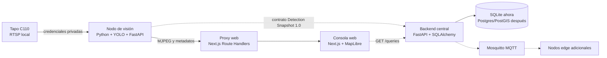

# Arquitectura de VIGIA

## Enfoque

VIGIA utiliza una arquitectura híbrida: nodos edge autónomos procesan video localmente y una plataforma central coordina consultas, consolida resultados y presenta rutas estimadas. El prototipo actual incluye la consola web, un nodo de visión físico y el backend central modular (`apps/backend`).

## Límites de los componentes

| Componente | Responsabilidad | No debe hacer |
|---|---|---|
| `apps/vision` | Capturar RTSP, ejecutar detección/tracking y publicar resultados locales | Exponer credenciales, administrar usuarios o construir rutas globales |
| `apps/web` | Mostrar dispositivos, consultas, preview y trayectorias | Conectarse directamente a RTSP o ejecutar modelos de visión |
| `apps/backend` | Persistencia central, CRUD, consultas de trayectoria y historial | Exponer RTSP, ejecutar YOLO o centralizar video continuo |
| `packages/contracts` | Definir mensajes estables entre componentes | Contener lógica de negocio o secretos |

Decisiones vigentes: [ADR-001](../adr/001-hybrid-edge-architecture.md), [ADR-002](../adr/002-backend-central.md). Modelo: [data-model.md](./data-model.md).

## Flujo implementado

1. La C110 entrega `stream2` mediante RTSP dentro de la red local.
2. El nodo de visión abre el stream con OpenCV y ejecuta YOLO + ByteTrack.
3. El worker conserva el último frame anotado y un snapshot de detecciones.
4. FastAPI en visión entrega MJPEG y metadatos; nunca la URL RTSP.
5. Route Handlers de Next.js actúan como proxy hacia el nodo edge.
6. El backend central selecciona dispositivos cercanos (Haversine), recupera detecciones candidatas y estima varias rutas con confianza (`GET /api/v1/queries`).

## Reglas de seguridad

- `.env`, pesos, videos y resultados generados no se versionan.
- RTSP se usa solamente dentro de la red local; no se publica el puerto 554.
- La consola accede al nodo mediante un proxy server-side.
- Las respuestas no incluyen rostros, credenciales ni la URL RTSP.
- El preview es una herramienta de desarrollo; su acceso deberá quedar autenticado antes de un despliegue real.

## Evolución prevista

1. Validar detección con una cámara física.
2. Sustituir datos simulados de la web por el API central.
3. Añadir autenticación de usuarios y endurecer el preview.
4. Incorporar Postgres/PostGIS y MQTT para múltiples nodos.
5. Evaluar OCR de placas como extensión opcional (ver modelado de placas).
