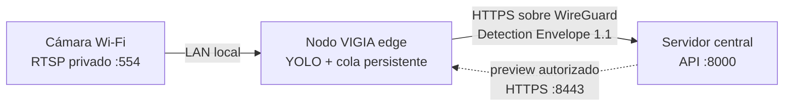

# Conectividad privada para cámaras Wi‑Fi remotas

## Decisión

La cámara no se conecta directamente al servidor central. Cada sede instala un nodo edge en la misma LAN de la cámara; ese nodo consume RTSP localmente y se conecta por una VPN mesh al centro para publicar metadatos. La cámara conserva una IP privada y el puerto 554 nunca se publica en Internet.



Para el MVP se adopta Tailscale, que construye la malla sobre WireGuard, atraviesa NAT sin abrir puertos y permite limitar los flujos con tags y grants. Una instalación autogestionada puede sustituir el plano de control por Headscale sin cambiar los contratos de VIGIA.

## Por qué la VPN termina en el edge

- La Tapo C110 no ejecuta un cliente VPN.
- El video permanece en la sede y el centro recibe principalmente metadatos.
- No se anuncian redes domésticas como `192.168.1.0/24`, que suelen repetirse entre sedes y generar rutas solapadas.
- Una caída del centro no interrumpe la captura: los eventos quedan en `EVENT_OUTBOX` y se reenvían en orden al reconectar.

Solo se usaría un subnet router para diagnóstico excepcional. No debe anunciarse toda la LAN ni usarse como camino normal del video.

## Aprovisionamiento

1. Crear en el panel de Tailscale los tags `tag:vigia-central` y `tag:vigia-edge`.
2. Cargar y adaptar [`tailscale-policy.example.hujson`](./tailscale-policy.example.hujson). Sustituir el correo del grupo administrador.
3. Crear claves de autenticación preaprobadas y etiquetadas. Guardarlas como secretos; no se escriben en `.env` ni en el repositorio.
4. Registrar el servidor central:

```bash
sudo tailscale up --auth-key=TSKEY_CENTRAL --hostname=vigia-central --advertise-tags=tag:vigia-central
tailscale serve --bg 8000
```

5. Registrar cada nodo edge:

```bash
sudo tailscale up --auth-key=TSKEY_EDGE --hostname=vigia-edge-cam-01 --advertise-tags=tag:vigia-edge
tailscale serve --bg --https=8443 8001
```

6. Configurar el nodo. El nombre MagicDNS real se obtiene con `tailscale status`:

```dotenv
VIGIA_CENTRAL_API_URL=https://vigia-central.NOMBRE-TAILNET.ts.net
VIGIA_CENTRAL_API_TOKEN=un_secreto_distinto_de_la_clave_tailscale
```

7. Configurar el mismo valor de `VIGIA_CENTRAL_API_TOKEN` como `INGEST_API_TOKEN` en el backend. Para un piloto real debe emitirse un token diferente por nodo; el token único actual es una medida transitoria del MVP.

## Validación de aceptación

Desde el edge:

```bash
tailscale ping vigia-central
curl -fsS https://vigia-central.NOMBRE-TAILNET.ts.net/health
```

Luego se desconecta la salida a Internet durante cinco minutos mientras la cámara sigue activa. Debe crecer `publisher.pendingEvents` en `/api/v1/status`. Tras reconectar, debe volver a cero y reenviar el mismo `eventId` no debe incrementar el conteo lógico de detecciones.

## Controles obligatorios

- No usar Tailscale Funnel: el servicio debe permanecer dentro de la tailnet.
- Denegar edge→edge; un nodo solo necesita llegar al HTTPS del centro.
- Permitir central→edge únicamente para preview/estado autorizados y desactivarlo si no se usa.
- Rotar auth keys y tokens de ingestión; las auth keys se tratan como contraseñas.
- Mantener NTP activo en centro y edge.
- No anunciar `192.168.0.0/16` ni subredes domésticas completas.

Referencias operativas: [servidores etiquetados](https://tailscale.com/kb/1245/set-up-servers), [grants de mínimo privilegio](https://tailscale.com/docs/reference/syntax/grants), [Tailscale Serve](https://tailscale.com/docs/reference/tailscale-cli/serve) y [acceso a dispositivos sin cliente](https://tailscale.com/docs/use-cases/personal-or-at-home-use/access-devices-without-tailscale?tab=linux).
